<table width=100% border=>
<tr><td colspan=2><h1>EXERCISE 01 - IoT : End to End scenario using MQTT and Gateway Cloud</h1></td></tr>
<tr><td><h3>SAP Partner Workshop</h3></td><td><h1> &nbsp;90 mins</h1></td></tr>
</table>


## Description
This document provides you with the exercises for the hands-on session on SAP Cloud Platform Internet of Things. This scenario will help you to go through the following activities:

* Creating Data Model
* Device on boarding with Gateway Cloud using MQTT protocol.
* Sending Data with Paho MQTT Client
* Consume Data via IoT Services Cockpit

>NOTE: Use Google Chrome browser.


## Target group

* Developers
* People interested in SAP Leonardo and Machine Learning


## Goal

The goal of this exercise is to create a new data model in the IoT Service cockpit, to onboard a new device and a new sensor with SAP Gateway Cloud using MQTT protocol, to send data with Paho MQTT Client and finally to consume them via IoT Services Cockpit and APIs


## Prerequisites

Here below are prerequisites for this exercise.

* An SAP IoT Service system. It will be provided by your instructor
* A remote desktop connection app to access the remote system


## Steps

1. [Introduction](#introduction)
1. [Creating device data model](#creating-device-data-model)
1. [Device and sensor onboarding](#device-and-sensor-onboarding)
1. [Sending messages via MQTT using Paho client](#mqtt-Paho)
1. [Consuming and viewing sensor data](#consuming-sensor-data)
1. [Working with commands](#working-with-commands)


### <a name="introduction"></a> Introduction
The SAP Cloud Platform Internet of Things Service enables customers and partners to develop, customize, and operate IoT business applications in the cloud. IoT Services provides Lifecycle management at scale for IoT devices from onboarding to decommissioning. It also provides a way to securely connect to remote devices over a broad variety of IoT protocols. It provides gateway Edge which provides on-premise IoT edge processing and also gateway cloud which does centralized cloud based processing. The **IoT cockpit** is the user interface of the solution and provides access to various functions. It is the main interface for users to interact with the Internet of Things core service. It can be used for creating users and tenants, for creating device data models, for device onboarding and for adding new networks. It can also be used to deploy interceptors, retrieve network logs, visualize the data which are being ingested via IoT devices/sensors.  
	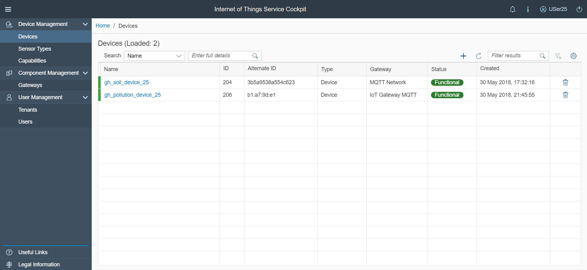


### <a name="creating-device-data-model"></a> Creating device data model
Centralized Device data model provides the schema of device related configurations including the data fields that will be exchanged. Default template is provided and can be downloaded from the SAP Cloud Platform Internet of Things services cockpit. If you have any deviations or additions, a new sensor type can be added to the default central data model. In the below steps, we will extend this default central device data model with the new fields "Soil pH and Moisture" that we will be getting from the device simulator. In this section, you will create few capabilities (measures and commands). A capability can be reused since it can be assigned to multiple sensor types: each capability can have one or many properties.

1.	Open the browser and navigate to the IoT Service Cockpit URL and log on with the tenant user credentials, provided by the instructor  
	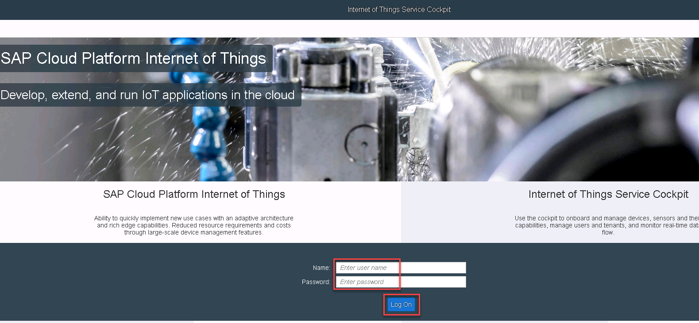

1.	Use the main menu to navigate to the Device Management -> Capabilities section and click on the "+" sign to add new capabilities like Soil pH and Soil Moisture  
	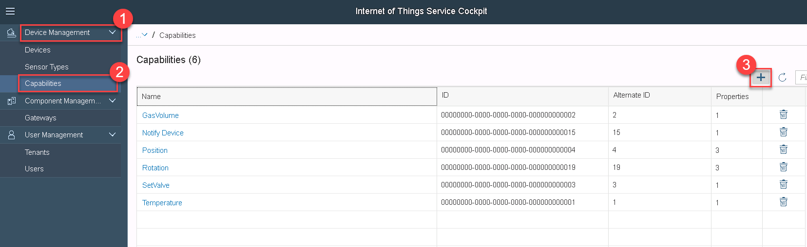

1. In the **General information** section enter **Name** as **Soil_pH** and in the **Properties** section enter the following information and click on **Create**. Ensure the capability is created successfully

	| Parameter | Value    |
	| --------- | -------- |
	| Name | Soil \_pH     |
	| Data Type | float    |
	| Unit Of Measure | pH |
	
	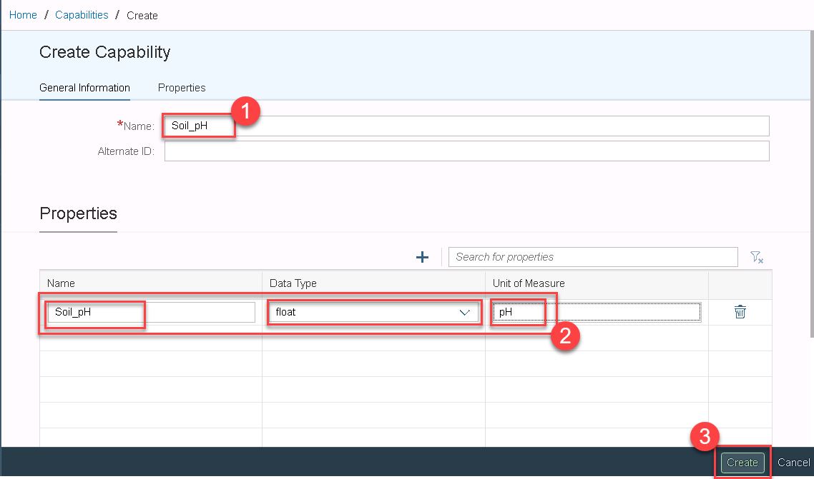

1.	Once again navigate to **Capabilities** section and click on the "**+**" sign to add the second capability **Soil_Moisture**  
	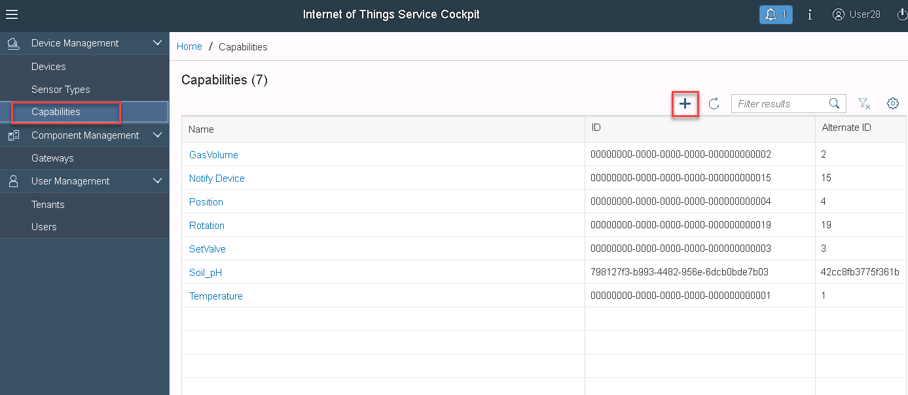   

1. In the **General information** section enter **Name** as **Soil_Moisture** and in the **Properties** section enter the following information and click on **Create**. Ensure the capability is created successfully

	| Parameter | Value      |
	| --------- | ---------- |
	| Name | Soil \_Moisture |
	| Data Type | float      |
	| Unit Of Measure | %    |
	
	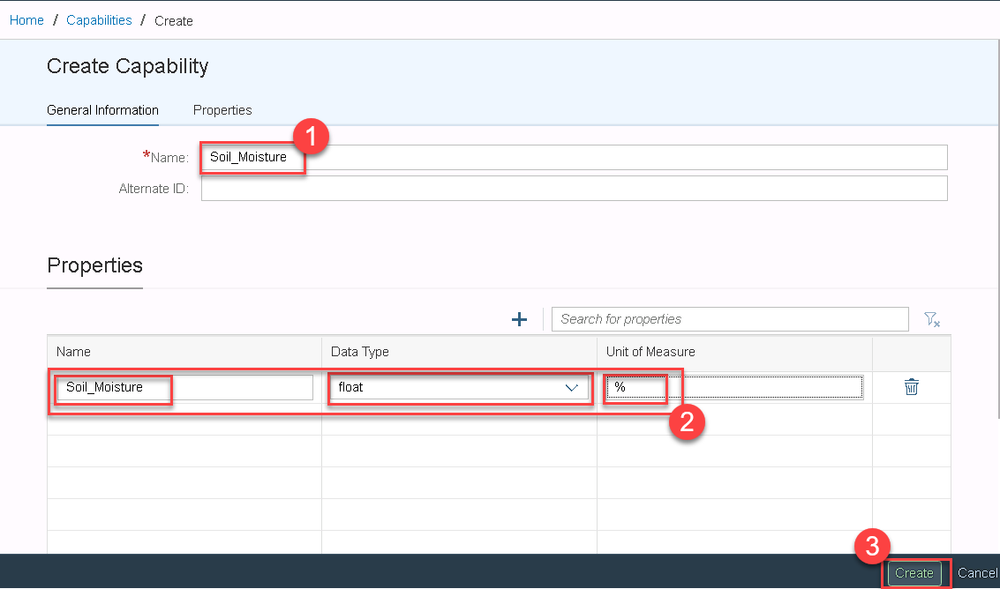

1.	Once again navigate to **Capabilities** section and click on the "**+**" sign to add the command Water_Alert  

1. In the **General information** section enter **Name** as **Water_Alert** and in the **Properties** section enter the following information and click on **Create**. Ensure the capability is created successfully

	| Parameter | Value   |
	| --------- | ------- |
	| Name | Water\_alert |
	| Data Type | string  |
	
	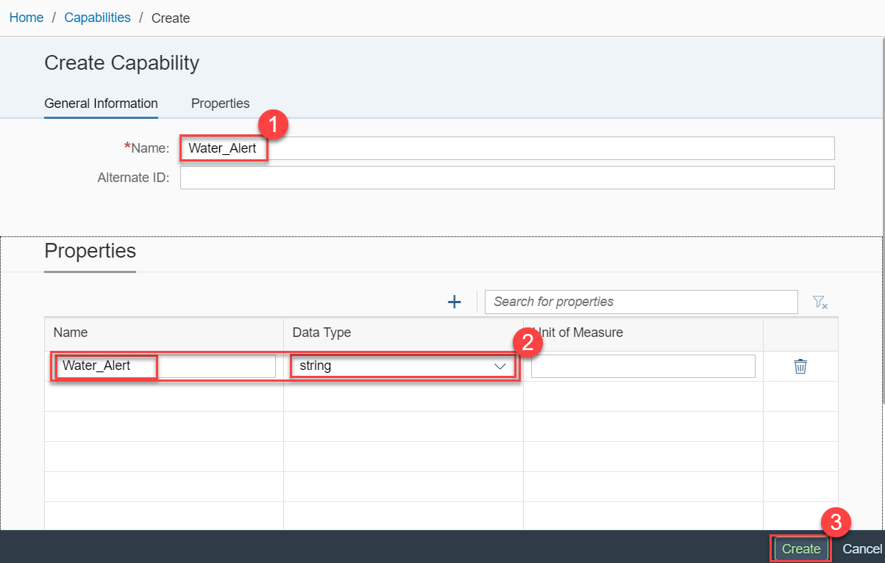

1. Navigate to **Device Management -> Sensor Types** and click on the "**+**" sign to add a sensor type for the Soil Sensor Type  
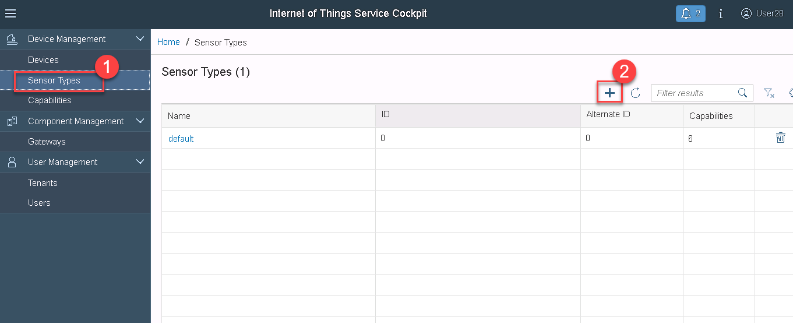

1. In the **General information** section enter Name as Soil_SensorTypeXX, where XX is your workstation ID and in the **Capabilities** section enter and add the earlier created capabilities

	| Capability | Type       |
	| --------- | ----------- |
	| Soil_pH | measure       |
	| Soil_Moisture | measure |
	| Water_Alert | command   |
	
	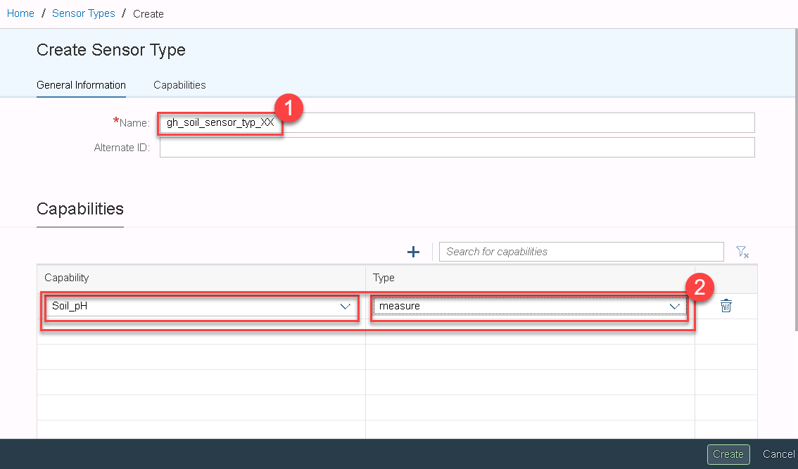
	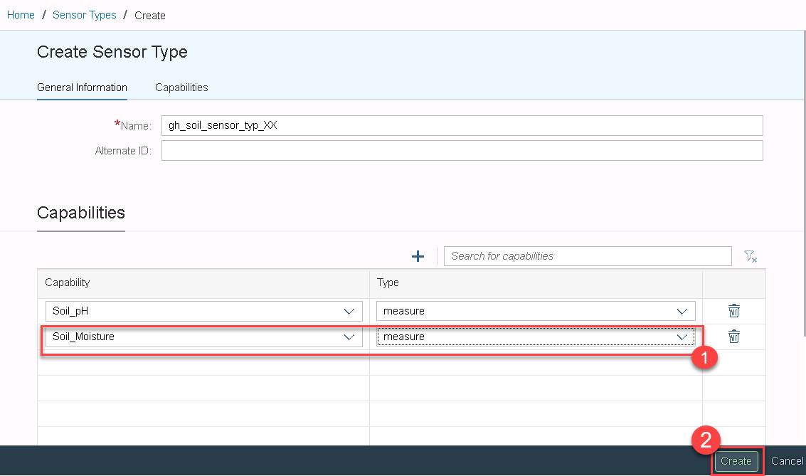
	
	Click on **Create**. Ensure the Sensor Type is created successfully

1. Congratulations! You have successfully created a new data model.

### <a name="device-and-sensor-onboarding"></a> Device and sensor onboarding
Each device exchanges data with a specific protocol (for example: MQTT in this exercise).  Each device corresponds to 1 unique physical node. We need to create physical node that corresponds to a physical device. In the following section, it is described how to create a Device for the MQTT network. Also we onboard all the sensors and Actuators for the Device.

1.	Use the main menu to navigate to the **Device Management -> Devices** section and click on the "**+**" sign to start the device creation process

	>NOTE: As an alternative, devices and sensors can also be created via APIs. In this exercises, we will create it via UI cockpit  

	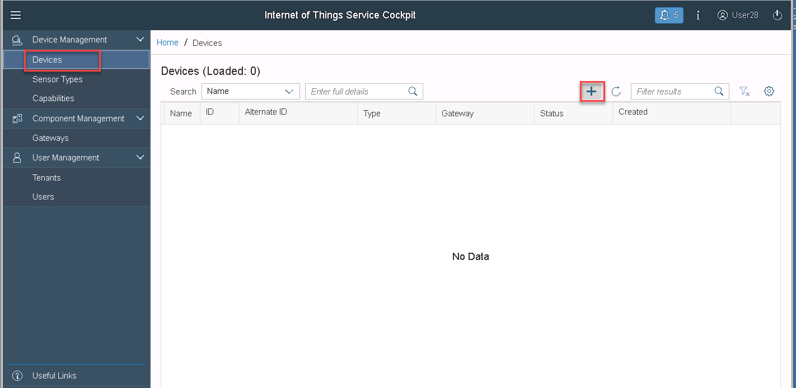

1.	In the **General Information** section, enter the following information and click on **Create**

	| Parameter | Value |
	| --------- |----- |
	| Name | Paho\_Client\_XX |
	| Gateway |MQTT Network |
	| Alternate ID | \<leave it blank\> |

	>NOTE: Ignore the Alternate ID as it's optional and is filled on Create. This would be required at later steps to be provided in Paho Client as well    

	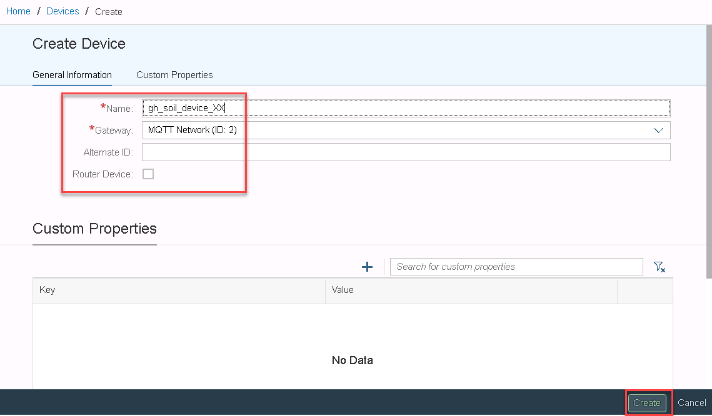

1.	In the new device, Sensor tab click on the "**+**" sign to create a new sensor  
	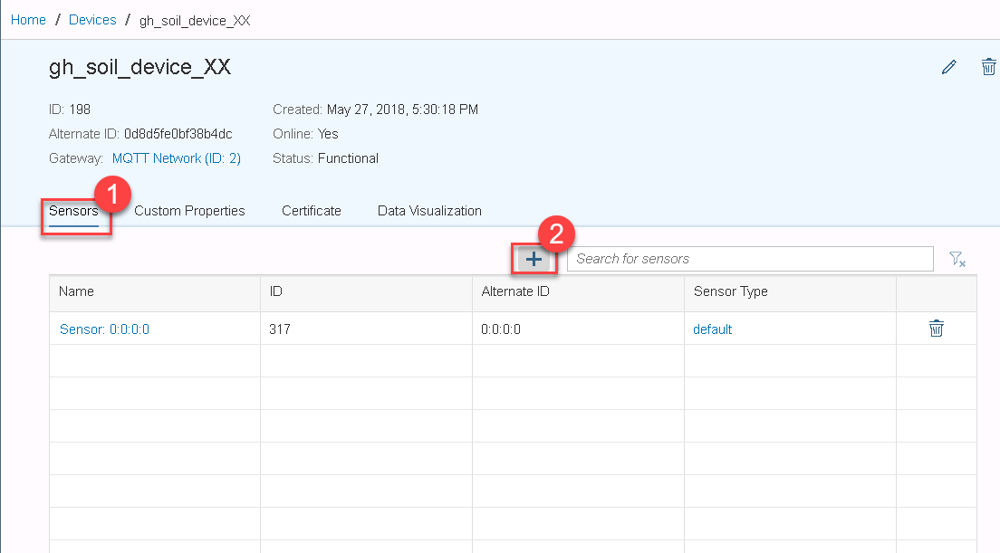

1.	In the General Information section, enter a name such as "**Soil_Sensor**", select Sensor Type you have created earlier (i.e. Soil\_SensorTypeXX, where **XX** must be replaced with your workstation ID) and ignore the Alternate ID as it's optional. This Soil\_Sensor automatically provides Soil\_pH, Soil\_Moisture and it also supports an alert: these are the capabilities we have previously defined. Once done click on **Add**  
	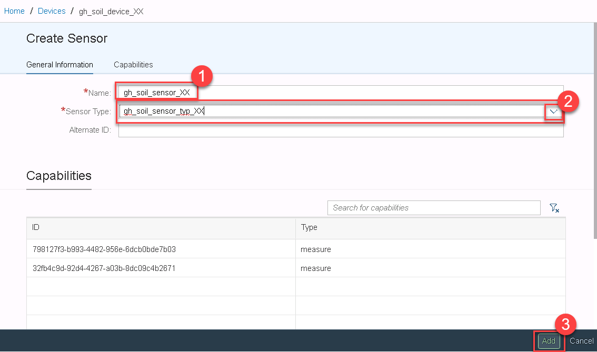

1.	The new sensor is created and you should be able to see the **Soil_Sensor** under the **Sensors** tab of the Paho\_Client\_XX device onboarded earlier  
	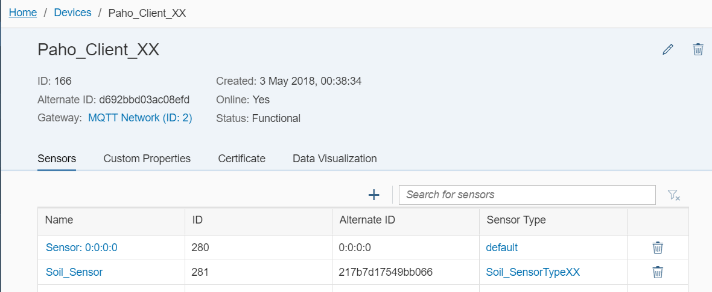

1. Be sure that your Paho Client device is selected, choose the **Certificate** tab and click on **Generate Certificate**  
	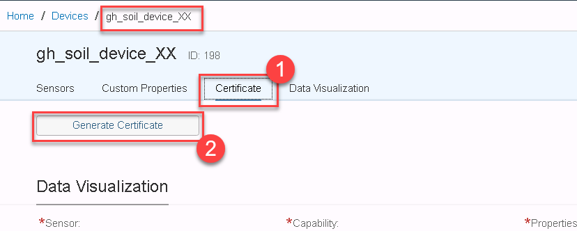

1. Choose the Certificate Type **P12** and click **Generate**  
	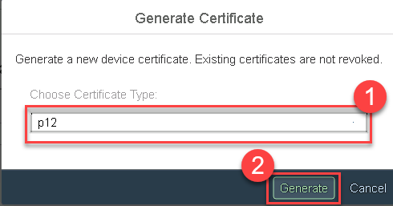

1. This will trigger a popup window providing you with a secret key which you must copy and save in notepad. Then click **OK**  
	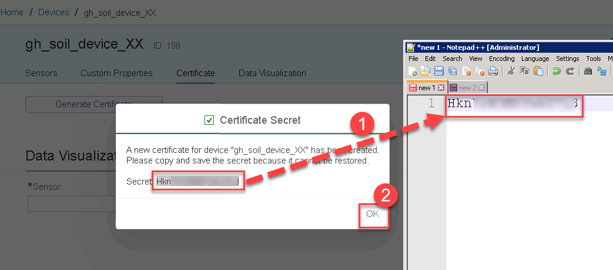

1. You can also see the downloaded certificate *Paho\_Client\_XX-device\_certificate.p12* in the Chrome browser status bar. Click on the small down arrow and choose **Show in folder**  
	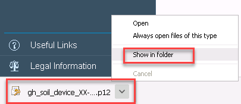


1. This will make you to understand where the certificate is located. Please keep in mind this location since it will be used in the next section  
	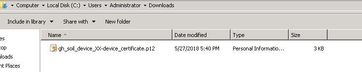

1. Congratulations! You have successfully onboarded a new device and a new sensor.


### <a name="mqtt-Paho"></a> Sending messages via MQTT using Paho client
In this step, we will send the data from Device Simulator that supports MQTT protocol. We have already on-boarded this simulator device during previous steps. Once we send the data, it would be received by Internet of Things Gateway Cloud and would be visible in the IoT services cockpit and via APIs.

1.	Launch the **MQTT Paho Client**, it should be located under the *C:\Student\PahoClient* folder  
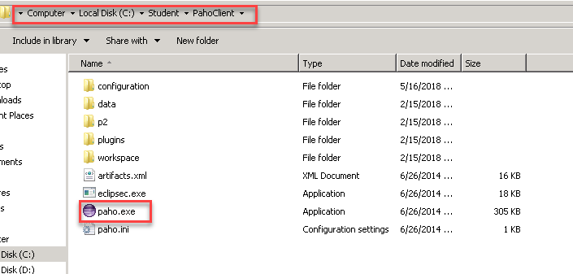

1. Click on **Run** in case you get the security warning  
	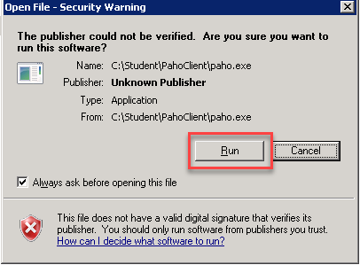

1.	Click on the "**+**" sign to create a new connection  
	

1.	Configure the **MQTT** tab of **connection1** with this information
	
	| Parameter | Value |
	| --------- | ----- |
	| Server URI | `ssl://<host_name>:8883` where **\<host\_name\>** is the host part in the cockpit  URL |
	| Client ID | The AlternateID of the Device Paho\_Client\_XX |

	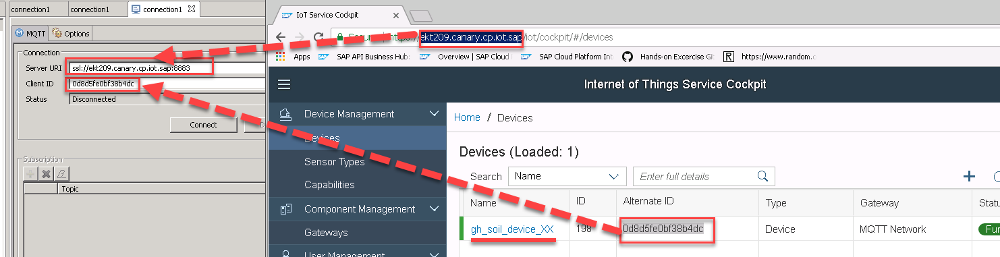

1.	Click on the **OPTIONS**, select **Enable SSL** and click on the first **Browse...** button to specify the Key Store Location  
	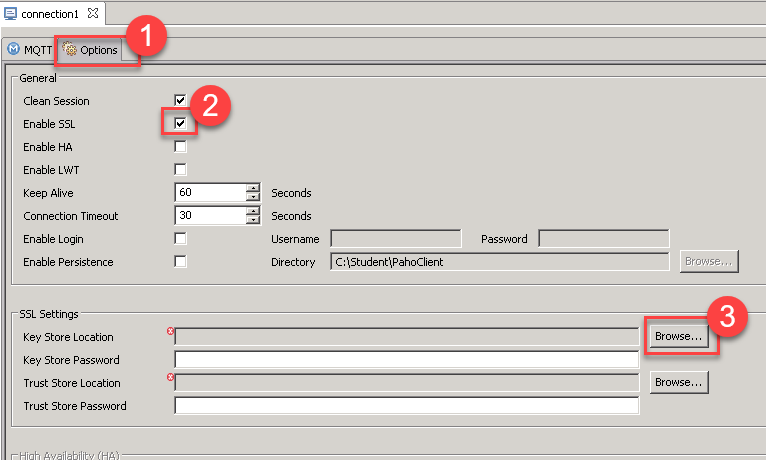

1.	Change the file extension search criteria to \*.p12 and browse for the *Paho\_Client\_XX-device\_certificate.p12* you have downloaded from IoT Services Cockpit  
	

1. As Key Store Password, specify the client secret you have copied in your notepad. Then click on the second **Browse...** button to locate the Trust Store repository  
	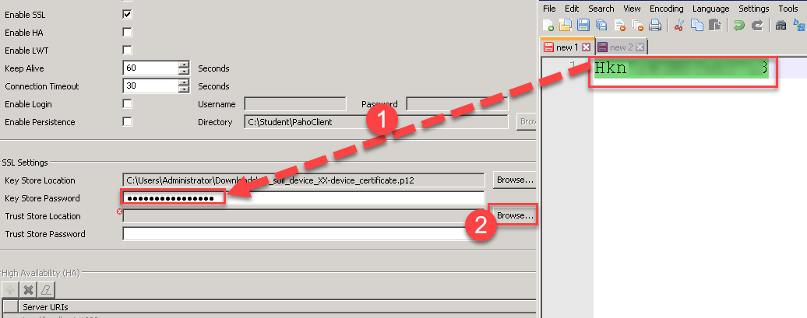

1. Change the file extension search criteria from \*.jks to \*.\* and go to the folder *\<JRE\_Installation\_Folder\>\jre\lib\security*, in your case it should be *C:\Program Files\Java\jre1.8.0_161\lib\security*. Once there, select the file *cacerts* and click **Open**  
	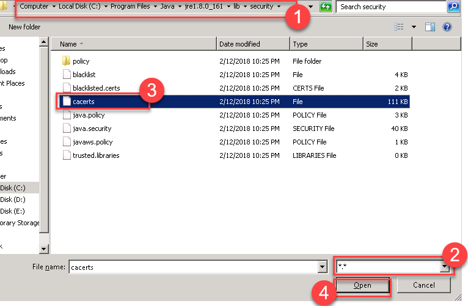

1. As Trust Store password, simply use the text "**changeit**"  
	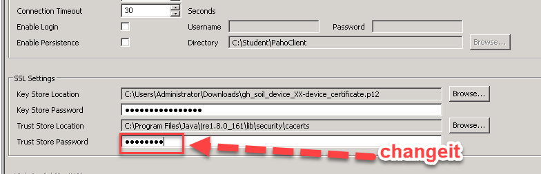

1.	Go to the **MQTT** tab and click on **Connect**  
	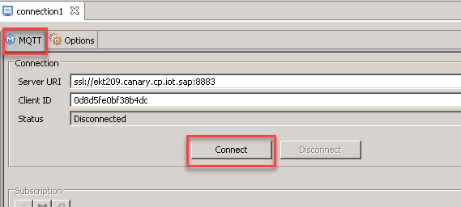

1.	Status should turn to **Connected** as shown in the picture  
	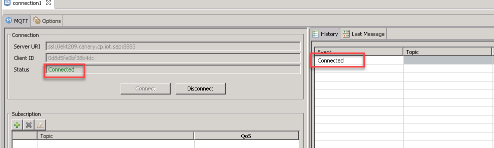

1.	In the **Publish** section, enter the topic `measures/<alternate_id>` replacing `alternate_id` with the **Alternate ID** of the device  
	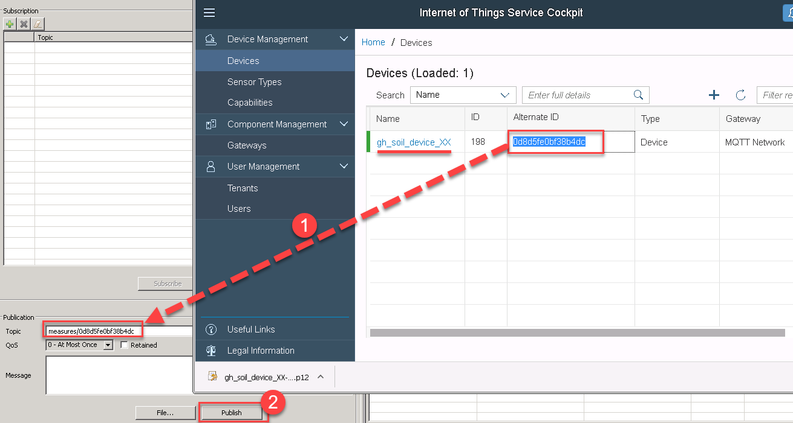

1. Use the default settings for **QOS**

1. Copy the following JSON script and paste it in a text editor

	```json
	{
	"capabilityAlternateId":[
		"<<< Soil_pH Capability Alternate ID >>>",
		"<<< Soil_Moisture Capability Alternate ID >>>",
		"<<< Water_Alert Capability Alternate ID >>>"
		],
	"measures":[7,35,"demo"],
	"sensorAlternateId":"<<< Sensor Alternate ID >>>"
	}
	```

1. Replace the **<<< Sensor Alternate ID >>>** with the **Alternate ID** you can read by going on your **Soil\_Sensor** in your **Paho\_Client\_XX** device  
	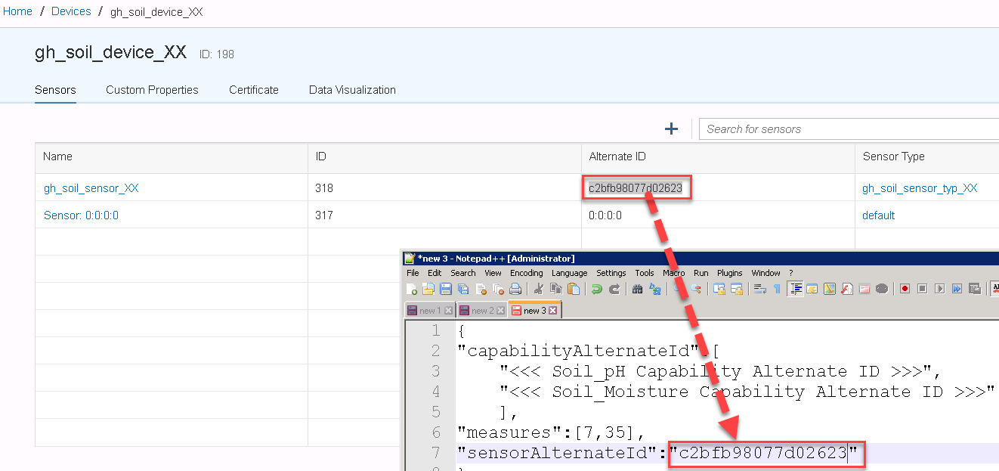

1. Then go to **Sensor Types -> Soil_SensorTypeXX**  
	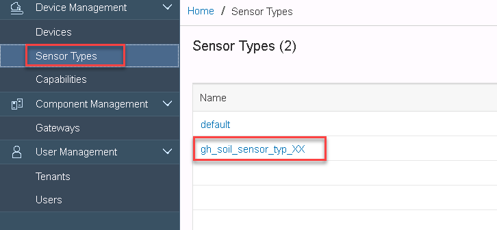

1. Replace the **<<< Soil_pH Alternate ID >>>** with the Alternate ID of the Soil_pH capability  
	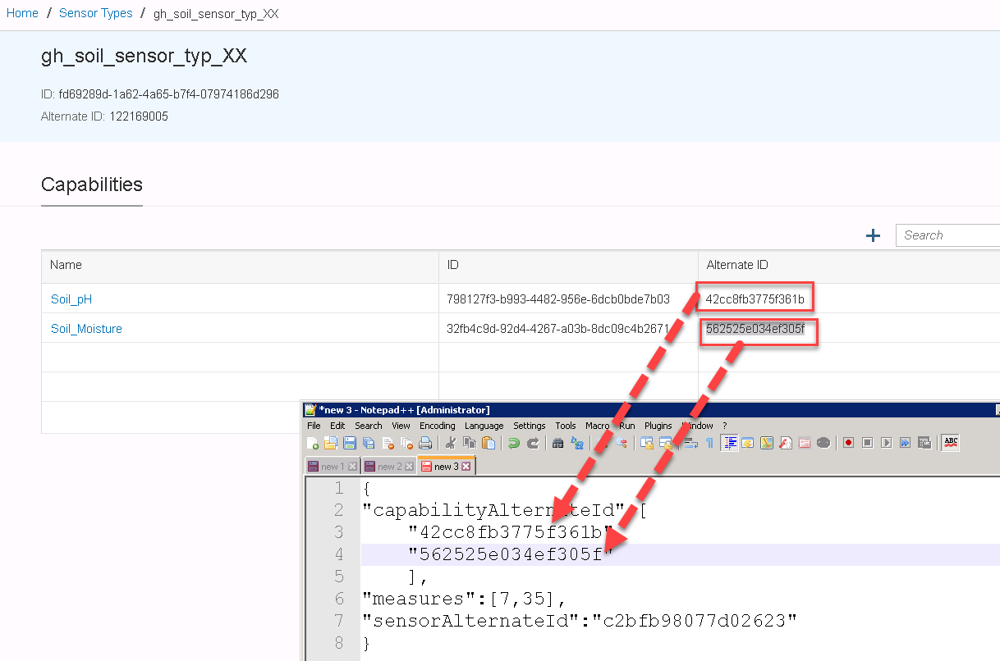

1. Repeat the previous 2 steps for the other capabilities (Soil_Moisture and Water_Alert). At the end copy the JSON script you have created and paste it in the Message text area of your Paho Client. Then click **Publish**  
	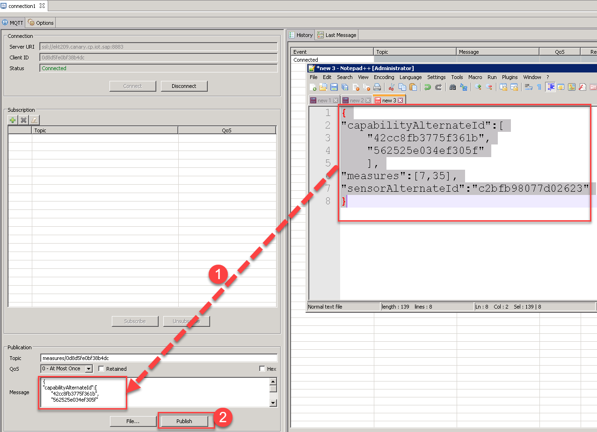

1. A new line is added to the history on the right  
	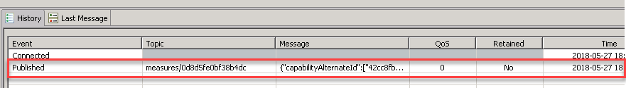

1. Repeat this step several times, each time by changing the values for Soil\_pH and Soil\_Moisture in the  measures section of the JSON file  
	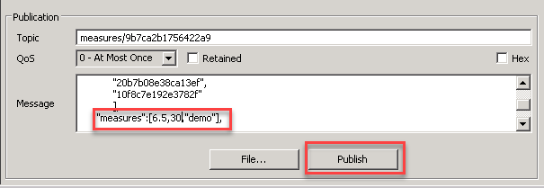

1. At the end you should have a history with several different pubblications  
	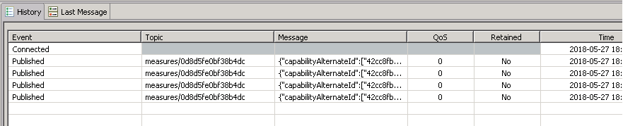

1. Congratulations! You have successfully sent messages via MQTT using the Paho Client.


### <a name="consuming-sensor-data"></a> Consuming and viewing sensor data
This section explains various ways we can consume and visualize the measurements which are sent to IoT Cloud Gateway.

1. Select your **Paho Client** device in the cockpit, go to the **Data Visualization** tab, specify your **Sensor** - Soil_Sensor, a **capability** - like Soil_pH and the **property** you want to analyze and click on the **Refresh** button. You should get a chart with all the data  
	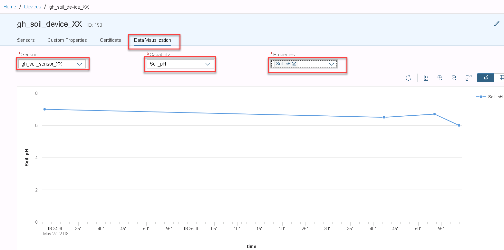

1.	Feel free to do the same for the **Soil_Moisture** capability  
	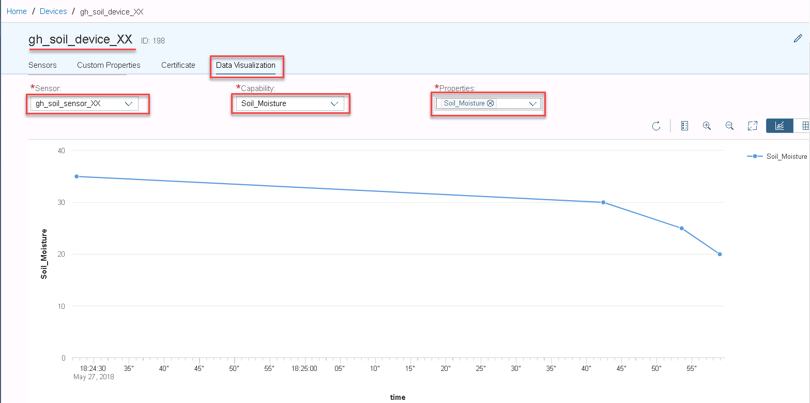

1. Congratulations! You have successfully consumed and analyzed sensor data.

## Summary
You have completed the exercise!

You are now able to:

* create a new Data Model
* onboard Devices with Gateway Cloud using MQTT protocol
* send Data with Paho MQTT Client
* consume Data via IoT Services Cockpit


Please proceed with next exercise.
