<table width=100% border=>
<tr><td colspan=2><h1>EXERCISE 03 - Maintenance Scenario using IoT to extend LoB</h1></td></tr>
<tr><td><h3>SAP Partner Workshop</h3></td><td><h1> &nbsp;90 mins</h1></td></tr>
</table>


## Description
This document provides you with the exercises for the hands-on session on SAP Cloud Platform Integration, Business Rules, Workflow and IoT. This scenario will help you to go through the following activities:

* Creating Device Data Model from IoT API Docs and IoT Cockpit
* Device onboarding with IoT Gateway Cloud using REST protocol
* Sending data with REST Client
* Working with SAP Cloud Platform Workflow service
* Working with SAP Cloud Platform Business Rules service
* Working with SAP Cloud Platform Integration, Importing and Configuring Integration Content
* Deploying Integration Flow
* Workflow monitoring


>NOTE: Use Google Chrome browser and Firefox if needed


## Target group

* Developers
* People interested in SAP Leonardo and IoT


## Goal

The goal of this exercise is to use IoT to extend LoB.


## Prerequisites

Here below are prerequisites for this exercise.

* A trial account on the SAP Cloud Platform. You can get one by registering here <https://account.hanatrial.ondemand.com>
* An SAP IoT Service system (provided by your instructor)
* A SAP Cloud Platform Integration account (provided by your instructor)
* Chrome browser with Postman REST client
* Firefox


## Steps

1. [Introduction](#introduction)
1. [Device onboarding](#device-onboarding)
1. [Install the certificate](#install-certificate)
1. [Sending messages via REST using Postman](#sending-messages)
1. [Consuming and viewing sensor data](#consuming-sensor-data)
1. [SAP Cloud Platform Workflow](#workflow)
1. [SAP Cloud Platform Business Rules](#br)
1. [Working with SAP Cloud Platform Integration](#cp-integration)
1. [Confirm successful scenario completion](#scenario-completion)
1. [House Keeping](#house-keeping)


### <a name="introduction"></a> Introduction
The SAP Cloud Platform Internet of Things Service enables customers and partners to develop, customize, and operate IoT business applications in the cloud. IoT Services provides Lifecycle management at scale for IoT devices from onboarding to decommissioning. It also provides a way to securely connect to remote devices over a broad variety of IoT protocols. It provides gateway Edge which provides one-premise IoT edge processing and also gateway cloud which does centralized cloud based processing.

The IoT cockpit is the user interface of the solution and provides access to various functions. It is the main interface for users to interact with the Internet of Things core service. It can be used creating user & tenants. Creating device data model, Device Onboarding and adding new networks etc. it can also be used to deploy interceptors, retrieve network logs, visualize the data which is being ingested via IoT devices/sensors.  
	

Before moving forward let's check up if all the prerequisites are in place for the completion of the entire exercise.

1. Download the [Exercise\_03\_Support\_Files.zip](files/Exercise_03_Support_Files.zip) file

1. Extract the content of this file in a proper location on your machine using the password provided by your instructor

1. You will find a file named *Iflowgenerator.zip*: extract it as well in a proper directory and open this folder
	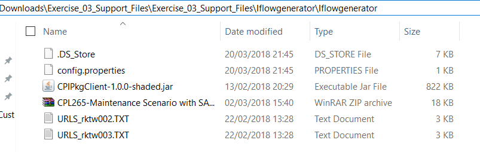

1. Open the *config.properties* file with your favourite text editor, change the XX value to your workstation ID and save the file  
	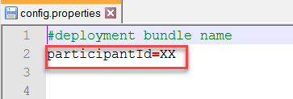

1. Open a terminal/command window and navigate to the folder where you have extracted the *Iflowgenerator*

1. Run the command

	```sh
	java -jar CPIPkgClient-1.0.0-shaded.jar "CPL265-Maintenance Scenario with SAP Cloud Platform Integration.zip"
	```
	The command is executed and it generates a file named *CPL265-IntegrationFlowXX.zip* where **XX** is you workstation ID
	>NOTE: don't care about the "error in opening zip file"  

	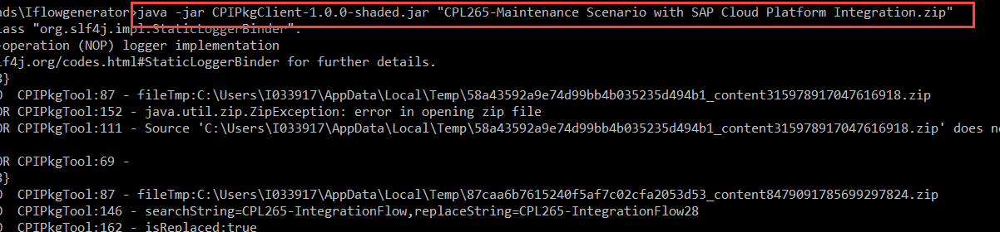
	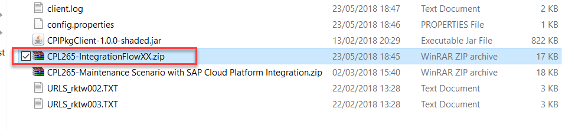

1.	Open the configuration URL document, which you will need to complete the exercise. Documents are available inside **Iflowgenerator** folder. Please use the file (*URLS\_rktw002.TXT* or *URLS\_rktw003.TXT*) assignment to you by the instructor.

1.	Take the **IoT Service Cockpit URL** and paste it in a new browser window  
	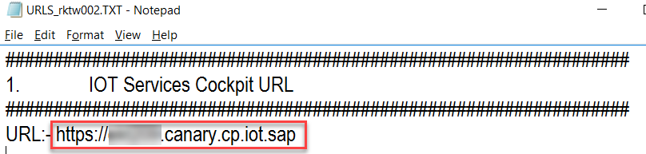
	

1. Congratulations! Prerequisites for the exercise have been verified.  	


### <a name="device-onboarding"></a> Device onboarding
Each device exchanges data with a specific protocol (for example: REST in this exercise).  Each device corresponds to 1 unique physical node. We need to create physical node that corresponds to a physical device. In the following section, it is described how to create a Device for the REST network.

1.	On the IoT cockpit logon page, Open the **API Docs**  
	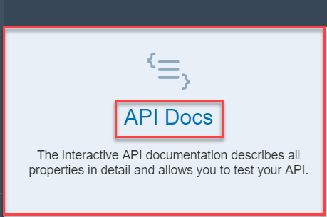
1. Choose **Authorize**
	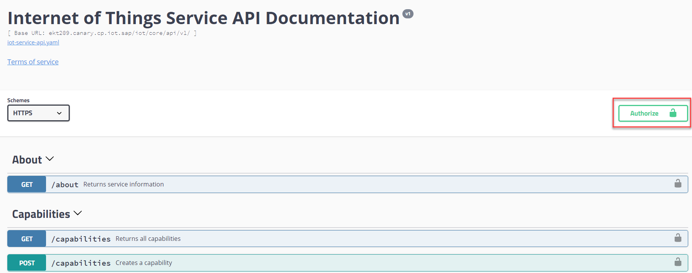
1.	Enter the user **name** and **password** provided by the instructor and choose **Authorize** to logon
	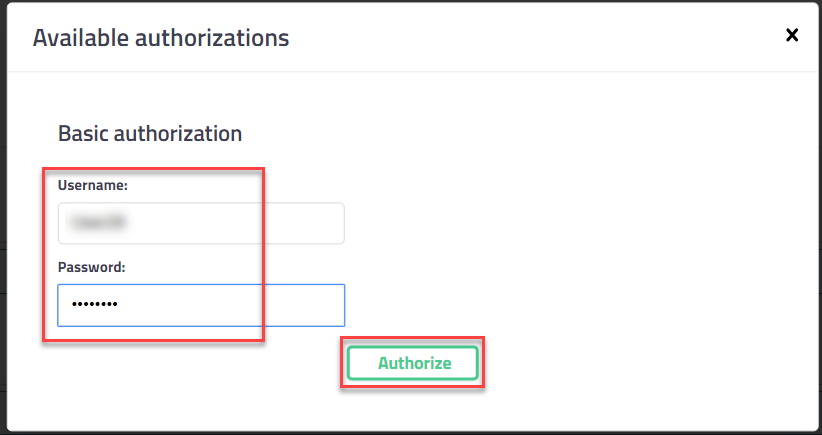
1. You should get an **Authorized** response. Close the the message from the top right corner  
	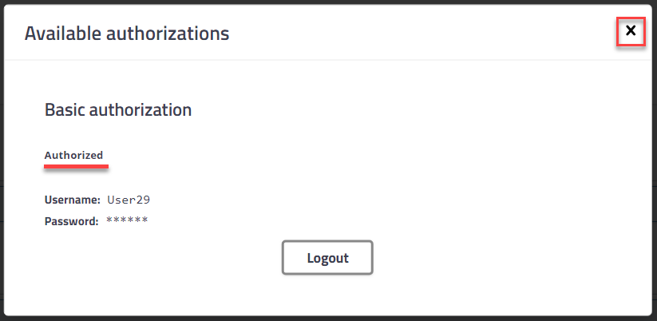
1.	 Choose the **Capabilities** section and open the **POST** request to create a new capability. Then click on **Try it out**  
	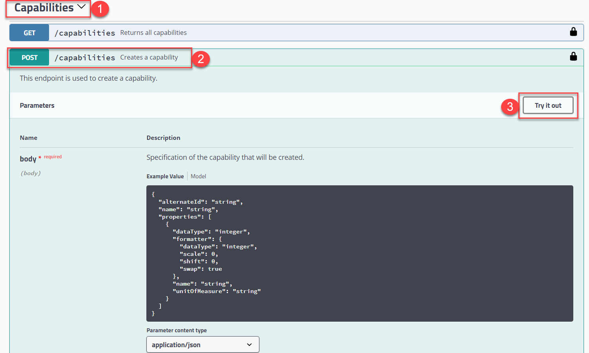
1.	Copy the following JSON script which defines a new capability named **Temperature** together with a new property and paste it in the **Example Value** text area. Then click **Execute**  

	```json
	{
	  "name": "Temperature",
	  "properties": [
	    {
	      "formatter": {
	        "swap": false,
	        "dataType": "float",
	        "shift": 0,
	        "scale": 0
	      },
		  "unitOfMeasure": "°C",
	      "dataType": "float",
	      "name": "Temperature"
	    }
	  ]
	}
	```
	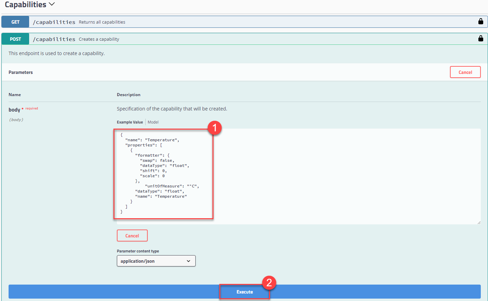

1.	You should get a response code of **200** and a response body like this. Copy and paste this response body in a text editor because you will need this information later in this section  
	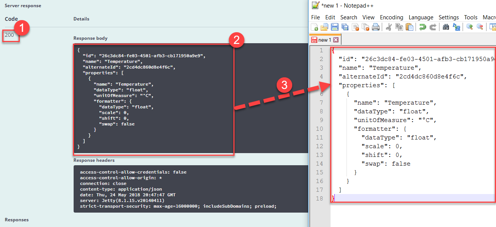

1.	Now you need to create a sensor type where the previously created Temperature capabilities is assigned to it. Go to the Home page of API services documentation and select **SensorTypes**  
	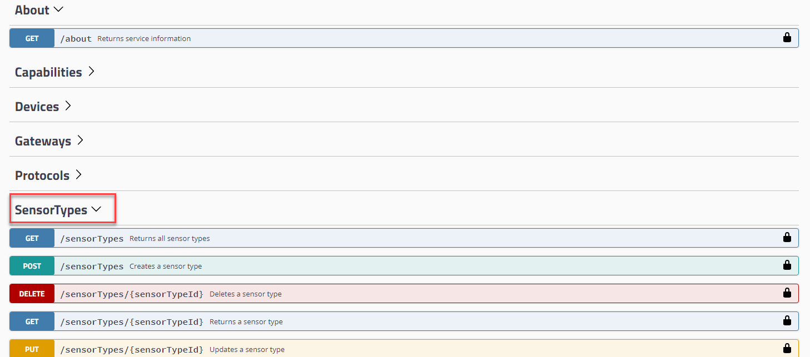

1.	Choose the **POST** request and click on **Try it out**  
	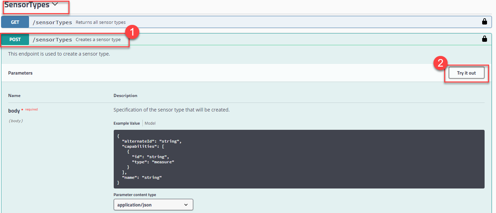

1.	Copy the following JSON script, which defines a new Sensor type with the name gh_climate_sensor_typ_XX (where XX must be replaced with your group number provided by the instructor). Replace **<<< Temperature Capability ID >>>** with the Temperature capability ID

 you have noted down in the previous steps. Once done paste the script in the **Example Value** text area and click **Execute**

 >NOTE: You must use **capabilities IDs** here because **AlternateIDs** are **NOT** used for creating sensor types

 ```json
 {
	  "protocol": "*",
	  "capabilities": [
	    {
	      "id": "<<< Temperature Capability ID >>>",
	      "type": "measure"
	    }
	  ],
	  "name": "gh_climate_sensor_typ_XX"
 }
 ```

 	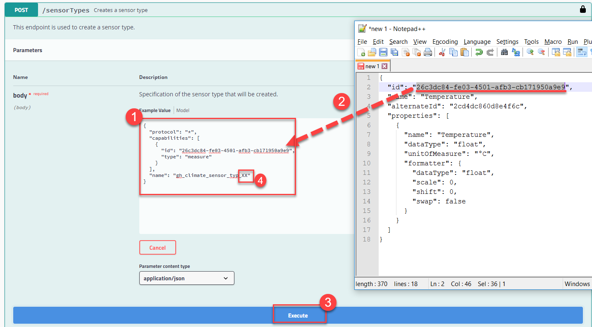

1. Log On to the **IoT Service Cockpit URL** with the credentials provided by the instructor  
	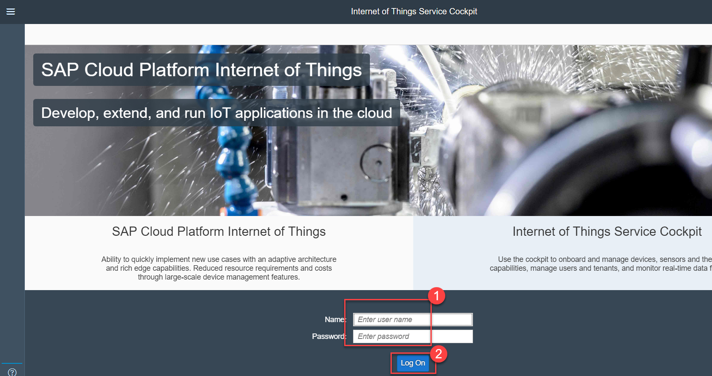

1.	Use the main menu to navigate to the **Device Management -> Devices** and click on the "**+**" to create a new device  
	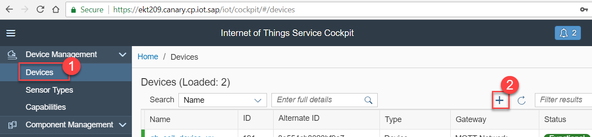

1.	In the **General Information** section, enter

	|Parameter|Value|
	|---------|-----|
	|Name|gh_climate_device_XX|
	|Gateway|Rest Network|
	|Alternate ID|simply leave it blank|

	replacing **XX** with your workstation ID; then click on **Create**. This way you are creating a new device named gh_climate_device_XX which is going to use the REST Network as a gateway.  

	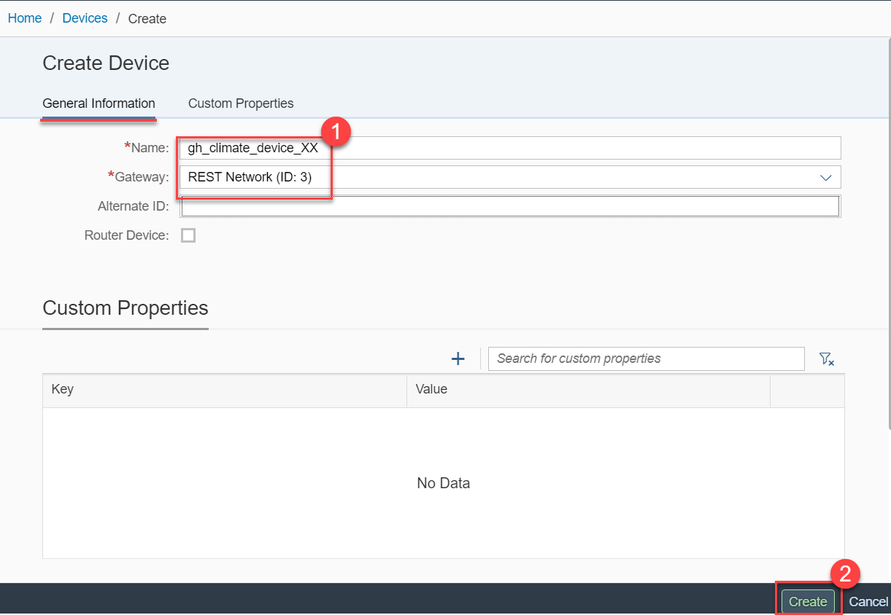

1.	Remaining on this device, in the **Sensor** tab click on "**+**" to add a new sensor to it  
	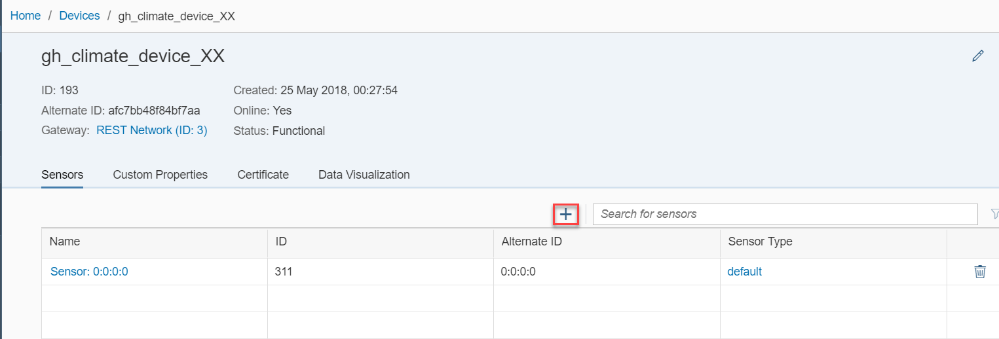

1.	In the **General Information** tab, enter

	|Parameter|Value|
	|---------|-----|
	|Name|gh_climate_sensor_XX|
	|Sensor Type|gh_climate_sensor_typ_XX|
	|Alternate ID|simply leave it blank|

	replacing **XX** with your workstation ID; then click on **Add**  

	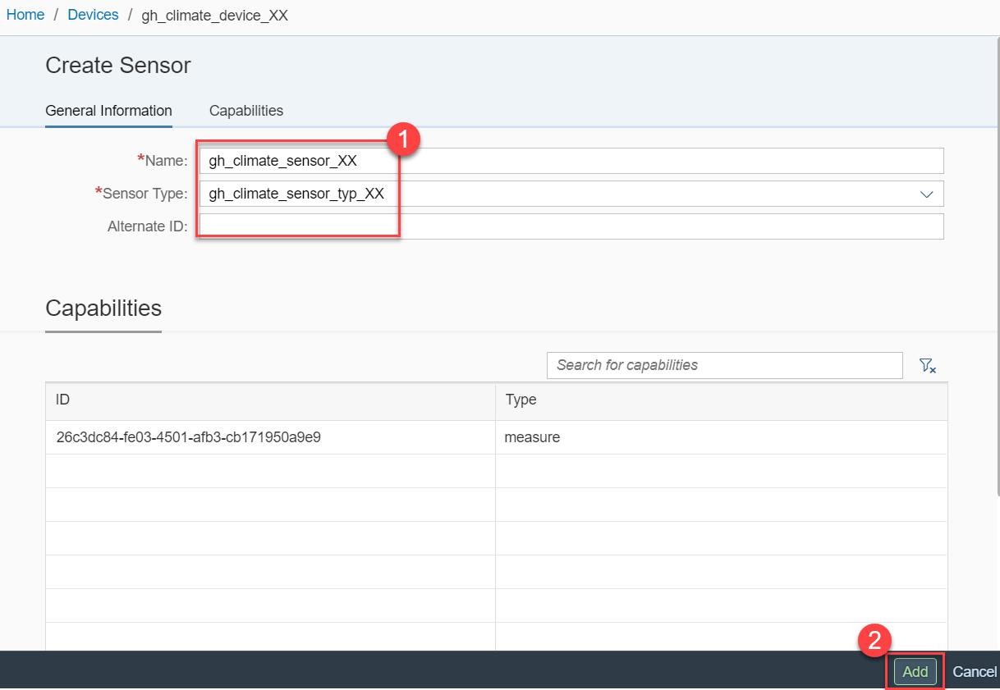

  The device with the sensor is created
	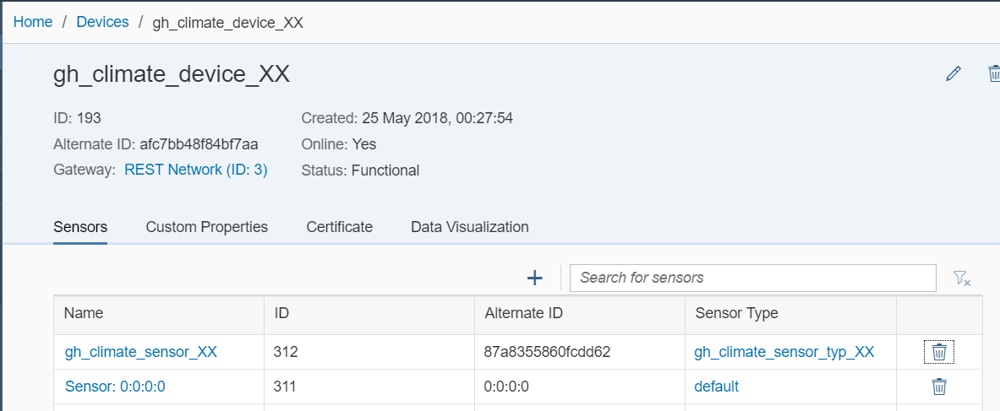

1.	Go to the **Certificate** tab and click on the **Generate Certificate** button  

	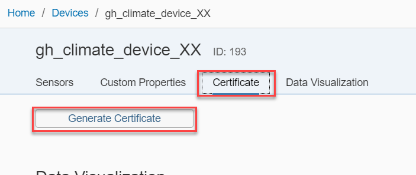

1.	Choose **p12** as the **Certificate Type** and click **Generate**  
	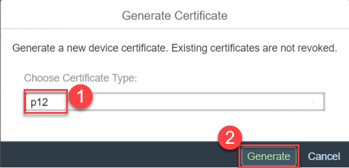. Save the certificate on your machine paying attention to the place where you are putting it

1.	Copy the secret key and paste it in a text editor because it will be required later in the exercise. Once done, click on **Ok** to close the window  
	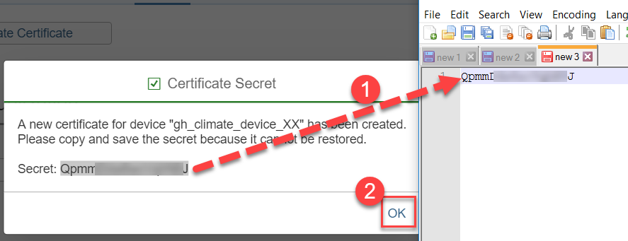

1. As a side note, if you need to know where you downloaded the certificate, you can click on the small down arrow on the Chrome status bar and click on **Show in Finder** for MAC users or **Show in Explorer** for Windows users  
	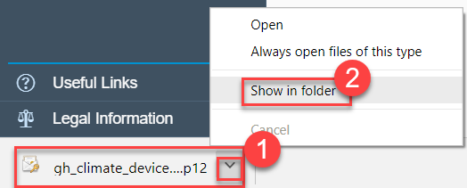

	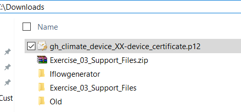

1. Congratulations! You have successfully on-boarded a new device and a new sensor.


### <a name="install-certificate"></a> Install the certificate
At this point we need in some way to install the certificate we have downloaded in your system so that it can be used by a REST client like POSTMAN, to post sensor data and also to read the posted sensor data. We are going to illustrate here two distinct procedures for installing this certificate, one for Windows and another for MAC.

#### --- Windows Users ---

1. Open Chrome browser and go to <chrome://settings> and Search for SSL in search text field: you get **Manage HTTPS/SSL certificates and settings**. Click on this link
	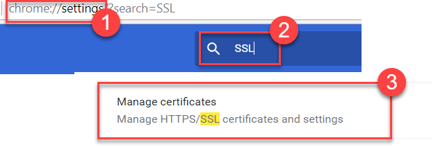

1.	Once in the certificate manager, go to the **Personal** tab and click on **Import...**  
	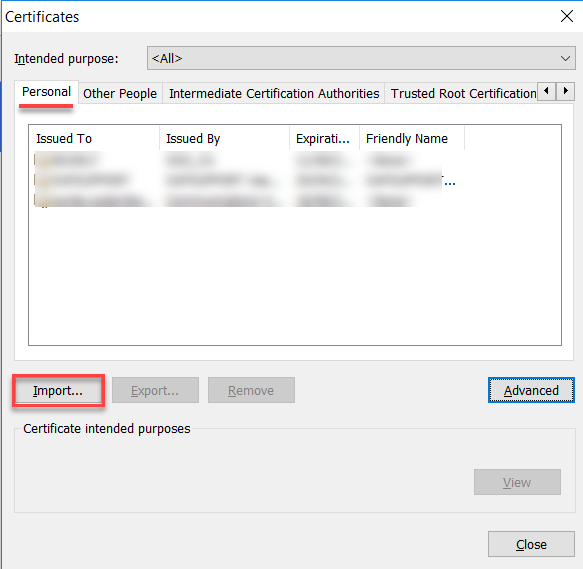

1.	**Certificate Import Wizard** will be opened: click on **Next**  
	

1.	Browse to folder where you have saved the device p12 certificate and choose "Personal Information Exchange p12" in the file extension drop down list
	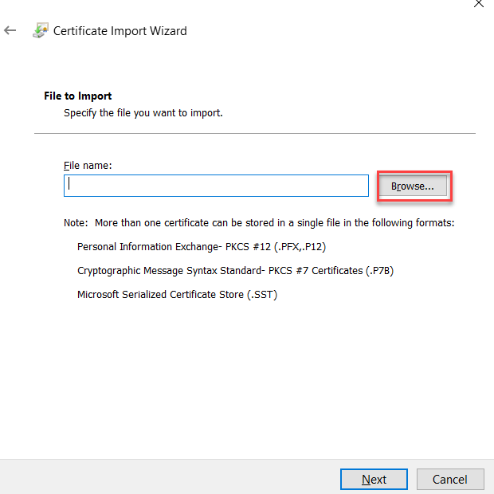
	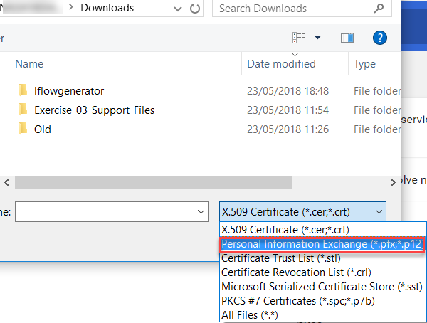  

1.	Select the certificate and click **Open**  
	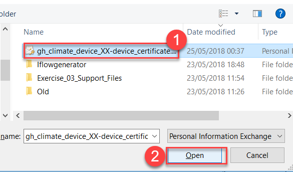

1.	Enter the **secret key** you obtained while downloading device certificate and noted down in a text editor; then click **Next**  
	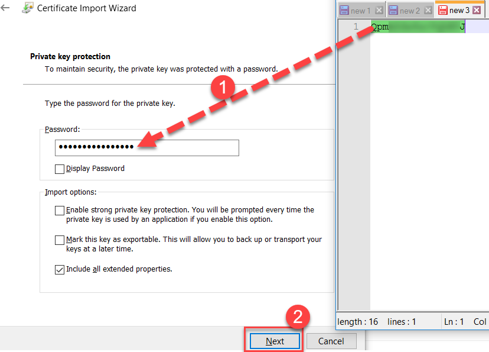

1. Click **Next**  
	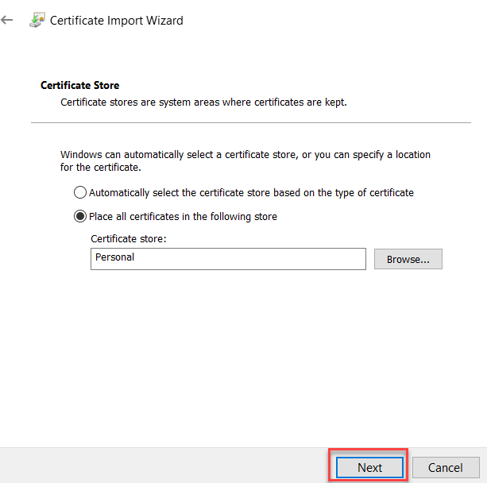

1.	Finally, click on the **Finish** button  
	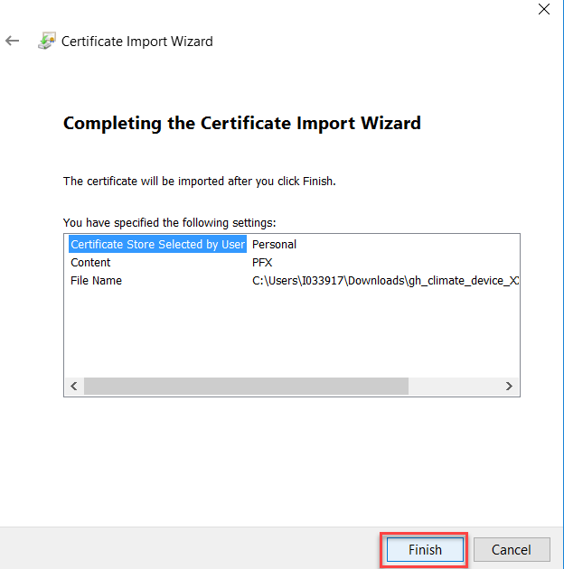

1.	You should receive the information that the import was successful.  
	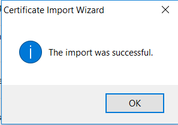


#### --- MAC Users ---

1. Open the **Keychain** utility and select **File -> Import Items...**  
	

1. Locate the p12 certificate you downloaded earlier  
	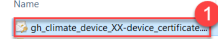

1. Enter your MAC credentials if required  
	

1. Enter the **secret key** you obtained while downloading the certificate and noted down in a text editor; then click **OK**  
	

1. The certificate is imported, but it's not yet trusted. You can see a message saying that this certificate was signed by an unknown authority. Double click on the certificate  
	

1. In the **Trust** section choose **Always Trust** for the parameter "When using this certificate"  
	

1. Enter your MAC credentials if required and click **Update Settings**  
	

1. The certificate is now successfully imported and trusted  
	


### <a name="sending-messages"></a> Sending messages via REST using Postman

1. If you have Chrome and/or Postman open, please close all windows before proceeding. Then open a new Chrome browser and navigate to <chrome://apps> and Click on **Postman**
	

1. Choose **POST** as new request type and enter as URL the line

	```
	https://<host_name>/iot/gateway/rest/measures/<device_alternate_id>
	```
replacing **\<host\_name\>** with the host name of your IoT service and **device_alternate_id** with your device gh_climate_device_XX alternate id as seen in the IoT service cockpit
	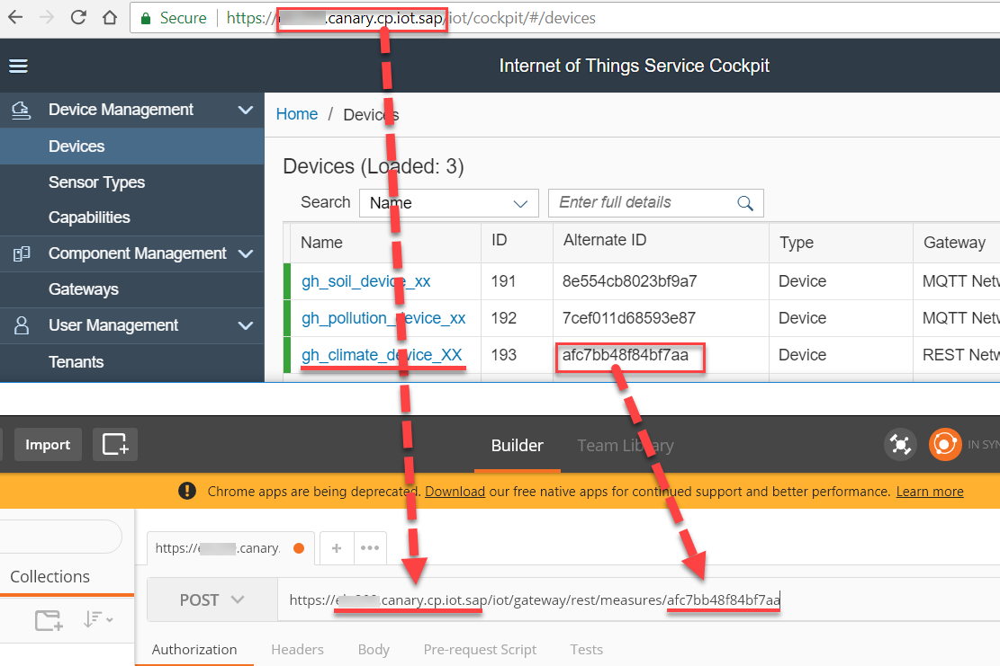

1. In the **Authorization** tab Choose **NoAuth** as **Type**  
	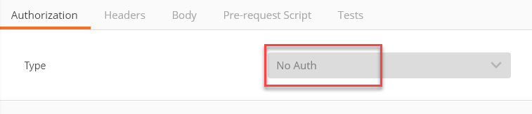

1. In the **Headers** tab, add a new header with `Content-Type = application/json`  
	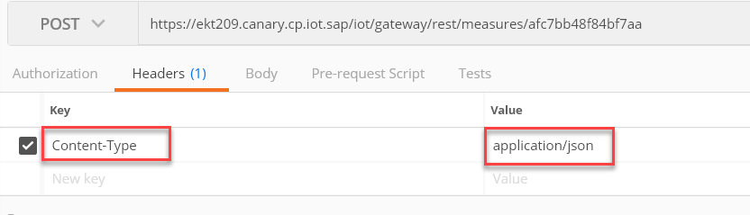

1. In the **Body** tab, select **raw** mode and enter the string

	 ```
	 {"capabilityAlternateId":[<Temperature_Alternate_ID>,"measures":[20],"sensorAlternateId":"<Sensor_alternate_ID>"}
	 ```

1. Replace **\<Sensor\_alternate\_ID\>** with the alternate ID of your sensor gh_climate_sensor_XX.  
 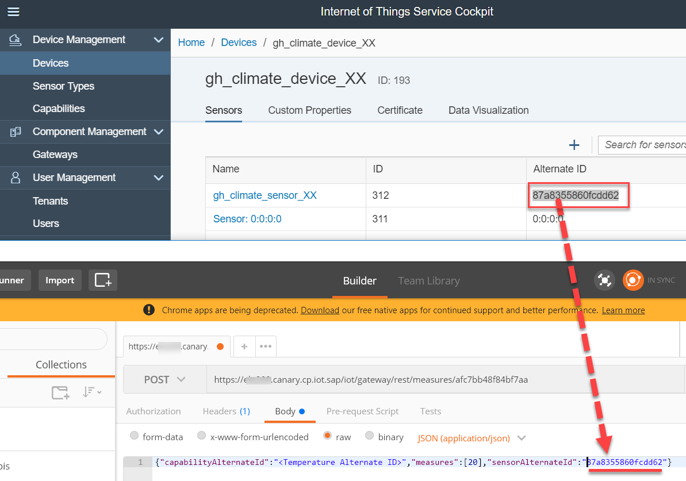

1. and replace **<Temperature_Alternate_ID>** with the alternate ID of your Temperature capability, found under your sensor gh_climate_sensor_typ_XX in **Sensor Types**.
Then click on **Send**
	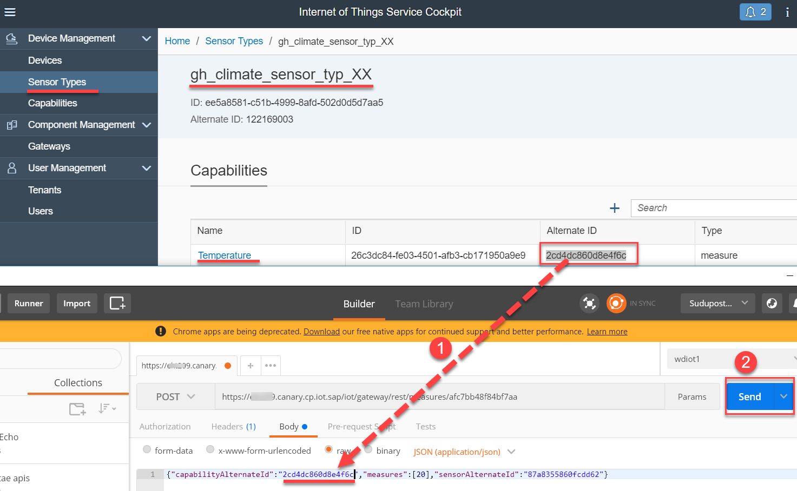

1. Select the right certificate and click on **OK**
	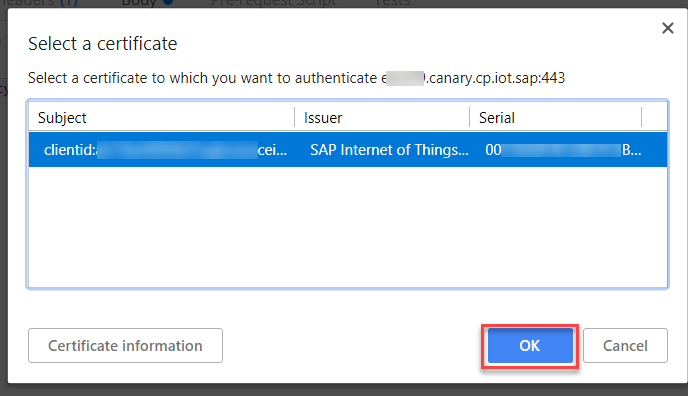

1. Enter your credentials if required  
	

1. You should get a return code of 200. This means that your POST request was successful  
	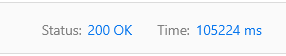

1. Repeat the step by changing (increasing or decreasing) the temperature value and sending the request again  

1. Congratulations! You have successfully sent some data to the IoT service using Postman REST Client.


### <a name="consuming-sensor-data"></a> Consuming and viewing sensor data
This section explains various ways we can consume and visualize the measurements which are sent to IoT Gateway Cloud.

1.	Open the Internet of Things Service Cockpit with your user credentials. In the main menu, go to Devices. Select your device (gh_climate_device_XX) and click on the Data Visualization tab  
	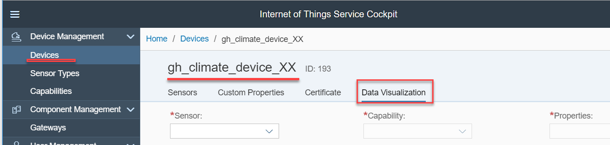

1.	For the 3 drop down list select the following parameters, replacing **XX** with your workstation ID;

	|Parameter|Value|
	|---------|-----|
	|Sensor| gh_climate_sensor_XX|
	|Capability| Temperature |
	|Properties| Temperature |

	The values will be displayed in a line chart
	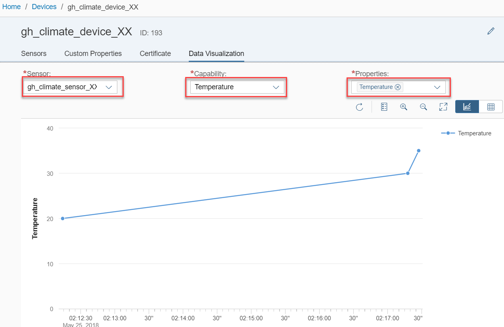

1.	Data can be also read from a REST client. In this case we will use again Postman, but with a basic authentication method. Please close Postman if it's already open and close the Chrome browser as well  

1. Reopen Chrome browser and go again to the <chrome://apps> link. Open Postman and click on the **+** sign after the last tab, to open a new tab  
	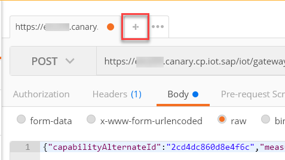

1. Select GET as the request type and enter the URL

	```
	https://<host_name>/iot/core/api/v1/devices/<device_ID>/measures
	```
where **\<host\_name\>** is the host name of your IoT Service and **\<device\_ID\>** can be read in the device page under the device name

	>NOTE: Please note down the device\_ID and the host\_name used here, since this information will be required at a later part of the exercise  

	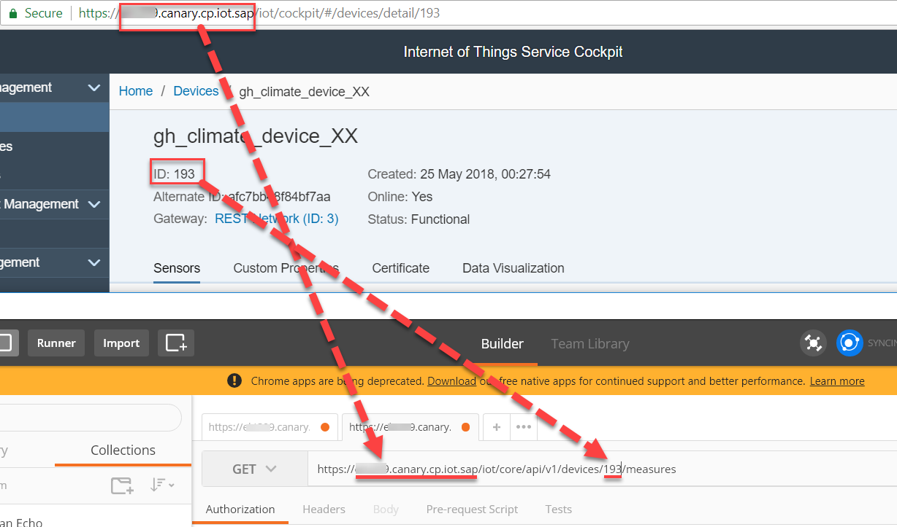

1.	Go to the **Authorization** tab, select **Basic Auth** type, enter your **credentials** for the IoT service and click on **Update Request**  
	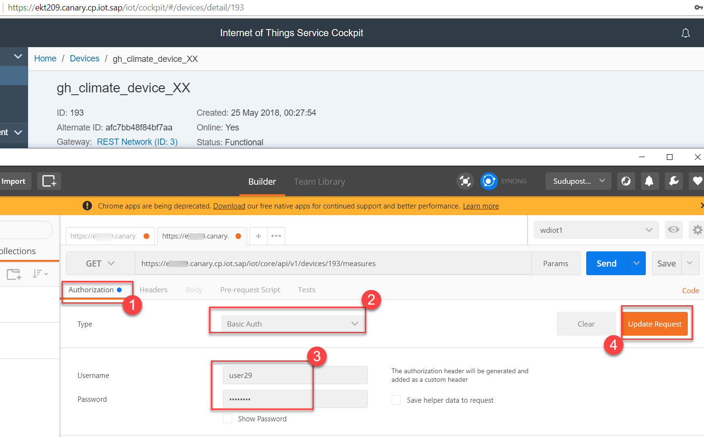

1.	Go to the **Headers** tab and enter the header `Accept = application/json`. Then click on **Send**  
	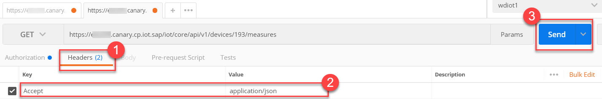

1. Click on **Cancel** if your get the request to choose the certificate: this because we are using Basic Authentication this time  
	

1.	You will see the results in the body section  
	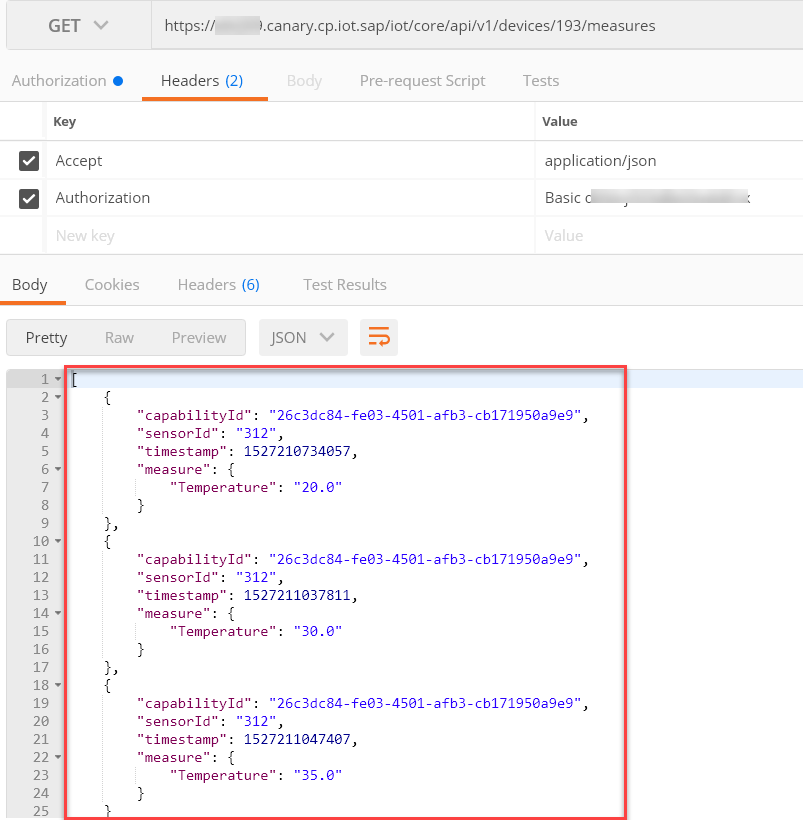

1. Congratulations! You have successfully consumed and analyzed sensor data.


### <a name="workflow"></a> SAP Cloud Platform Workflow
SAP Cloud Platform Workflow Service enables customers and partners to extend their core business process executed in S/4 HANA, Ariba, Concur, SuccessFactors, C4C and other 3rd Party applications. These extension applications enable customers to adopt changes in business very rapidly in an agile and non-disruptive way. Workflow Service enables business users to use SAP My Inbox, a FIORI based application to manage their tasks.  It offers out of the box FIORI based monitoring applications to keep track of the deployed workflows and workflow instances operated in the system.
Workflow Service offers BPMN 2.0 based Business Process Modeling tools in SAP Web IDE and enables customers/partners to quickly build and deploy workflows. It exposes REST APIs to Read/Create/Modify/Cancel workflow instances and task instances from the system.

#### --- Preparing SAP Web IDE Full-Stack ---
In this exercise, you will manage your workflow using SAP Web IDE Full-Stack.

1. Open the configuration URL document. Documents are available inside *Iflowgenerator* folder. Please use the file (*URLS\_rktw002.TXT* or *URLS\_rktw003.TXT*) assigned to you by the instructor

1. Copy the SAP Web IDE Full-Stack EU Data Center URL and paste it in a new Chrome browser window  
	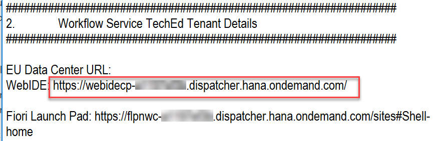

1. You SAP Web IDE Full-Stack opens up  
	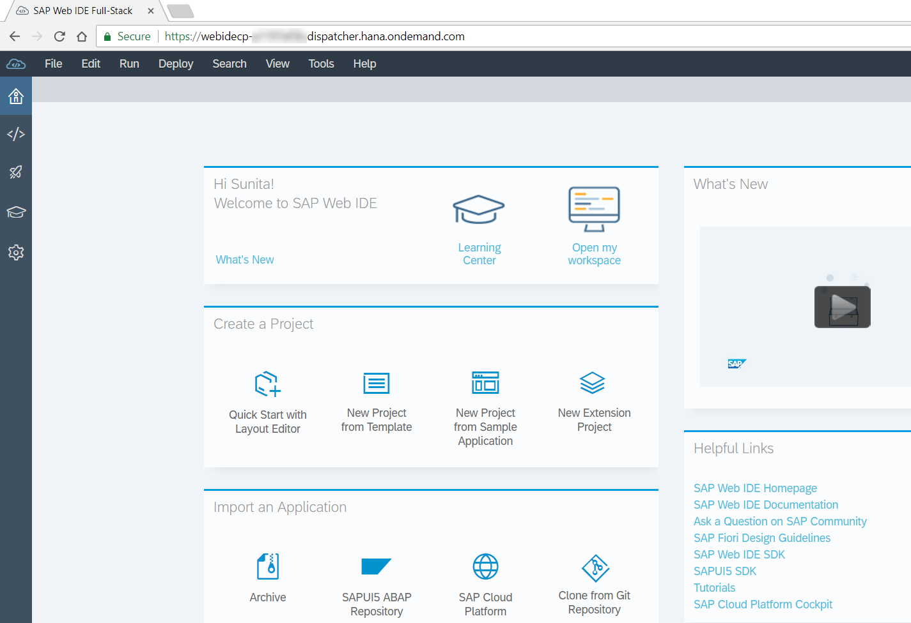

1. Click on the **small gear** on the left toolbar, select **Features**, enter "**workflow**" in the search box, the **Workflow Editor** plugin is listed. Set it to **ON** (if not set already) and click **Save**. You will be requested to refresh your SAP Web IDE: click on **Refresh**  
	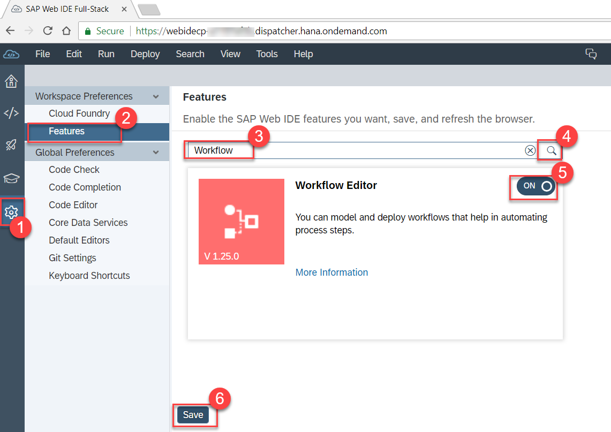
	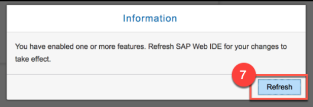

#### --- Deleting an existing project ---
If you find content from previous runs of the CPL265 session in the workspace, remove the content as follows:

1. On the left toolbar, click on the Development tab **</>**. Check your workspace: if you see that a project with the name *CPL265-ParticipantXX*, where **XX** is your workstation ID, already exists, please follow the next step to delete it, otherwise you can simply skip the next step  
	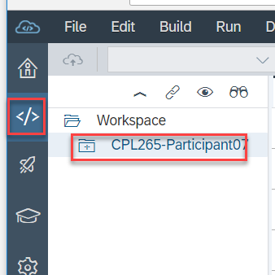

1. Right click on the name of the project that you want to delete and from the context menu choose **Delete**. Click **OK** to confirm the operation and the project will be removed from the workspace  
	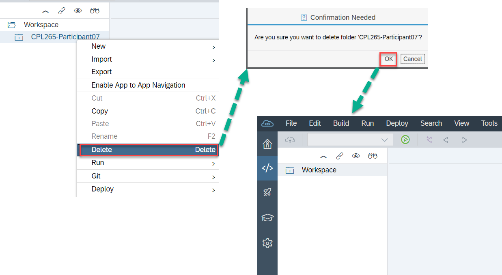

#### --- Creating a workflow project with SAP Web IDE Full-Stack ---
With the help of the IoT-enabled sensors, it is possible to monitor the health of associated devices, such as coolers. With the help of Business Rules, temperature data can be filtered to situations that are considered critical for the device, for example, when the device is unable to sufficiently cool the contents inside of it.

In such a situation, it might be advisable to request a service technician to check the device on site. As this is a costly operation, the respective request might require further remote investigations, detailed data analysis or approval. To coordinate these actions or route them to the right people for these tasks, we model a Service Request workflow.

1. Click on **File -> New -> Project from Template**  
	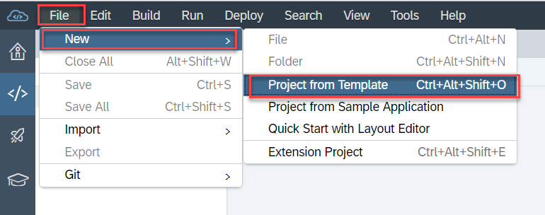

1. Select the Category **Business Process Management**: a **Workflow Project** template tile appears, select it and click **Next**  
	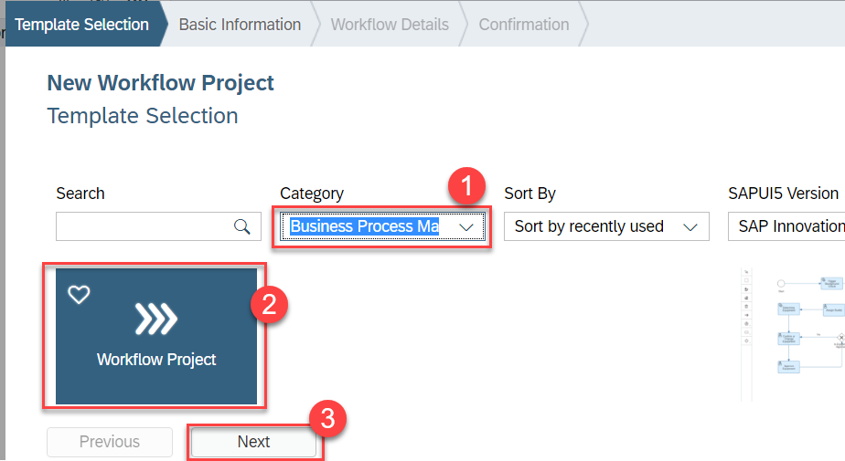

1. Enter the project name *CPL265-ParticipantXX*, where **XX** is your workstation ID, and click **Next**  
	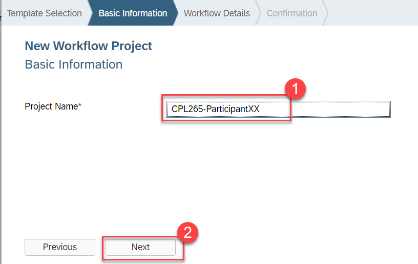

1. Enter *ServiceRequestParticipantXX* as the Workflow Project name, where **XX** is your workstation ID, and click **Finish**  
	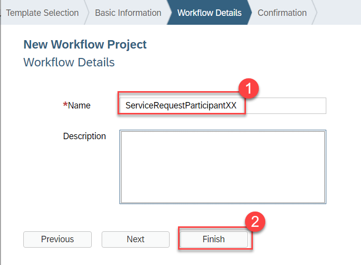

1. A new worflow is created  
	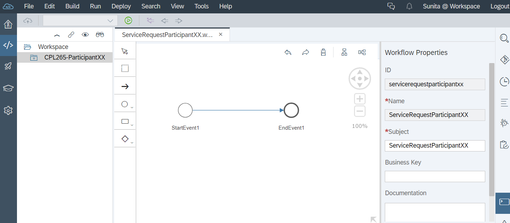

#### --- Model Workflow Properties and Steps ---
The workflow modeled in this exercise is condensed to a user task that shows relevant information in the "My Inbox" application. Here a user, such as a person in the role of a data analyst or service request coordinator, can decide on whether to send the technician on site.

The workflow could be extended in the following ways, which are supported by Cloud Platform Workflow functionality:

-	The task user interface could be enhanced to link to suitable data analysis tools or display relevant diagrams directly.
-	Depending on the approval of the coordinator, the service request could be entered into a Service Management system, for example by calling its REST APIs through the "Service Task" step type. For interactions requiring other protocols (e. g. SOAP), Service Tasks could be used to interact with Cloud Platform Integration to route the calls further.
-	When creating a service request, the workflow could be enhanced to wait for an asynchronous confirmation from the Service Management system, with the help of "Intermediate Message Events". The confirmation might contain the date and time, when the technician is expected to arrive and fix the device. The information could be forwarded to the service request coordinator.

>NOTE: colors and other visual appearance might differ slightly from the following screens, as the workflow editor might have received feature upgrades since production of this content

1. In the **Workflow Properties** pane on the right, enter this text as the **Subject**

	```
	${context.Device} (${context.DeviceId}): Confirm Service Request
	```

	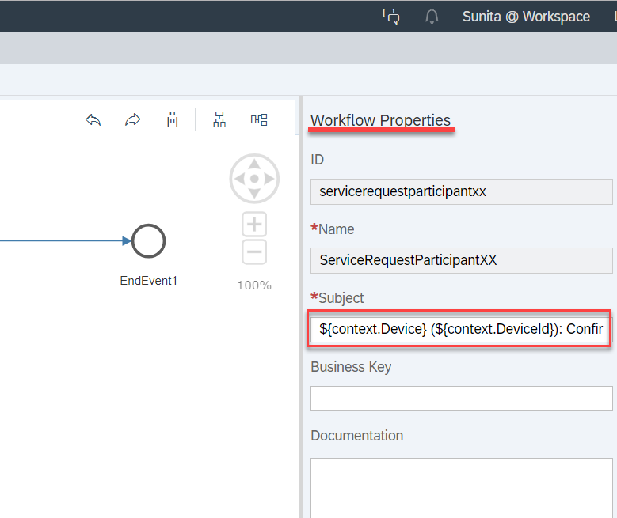

1. Click on the **Tasks** icon on the left side of the workflow editor and select **User Task**. A new task is created: drag & drop it just on top of the connection line between the start and the end events  
	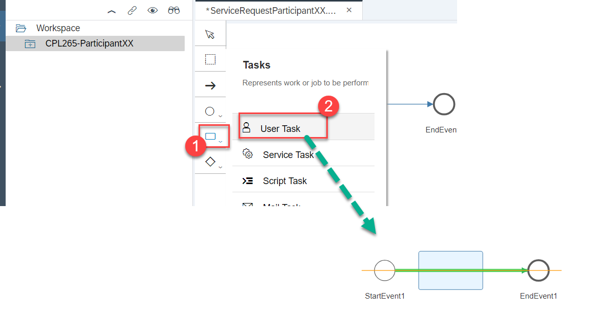

1. Be sure to have the new UserTask1 selected. On the right side, navigate to the **Details** tab and enter the following values:

 |Parameter|Value|
|---------|-----|
|Display texts -> Subject|`${context.Device} (${context.DeviceId}): Confirm Service Request`|
|Recipients -> Users|`${context.UserId}`|

 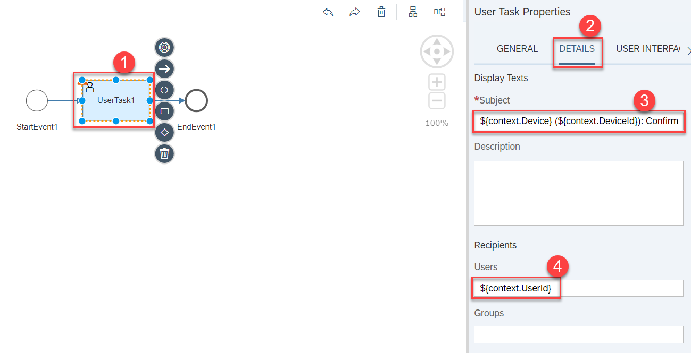

1. Be sure to have the new UserTask1 selected. On the right side, navigate to the **User Interface** tab and enter the following values:
|HTML5 App Name|cpl265|
|Component URL|webapp|
|SAPUI5 Component|cpl265-service-request|

When finished click on **Save**  
 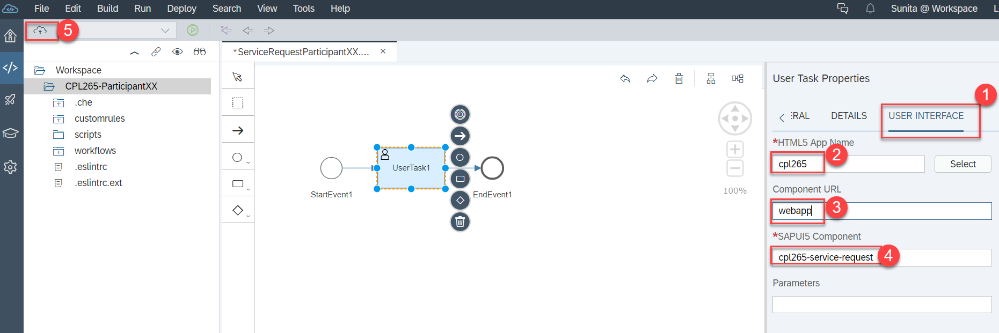


#### --- Deploy to SAP Cloud Platform Workflow ---


1. From the top menu, select **Deploy -> Deploy to SAP Cloud Platform Workflow**  
	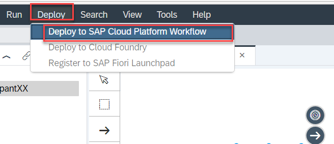

1. After a while you should receive a message confirming the project deployment  
	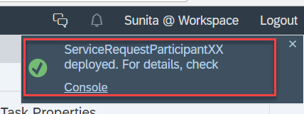

1. You can also check the status message in the console window if you want  
	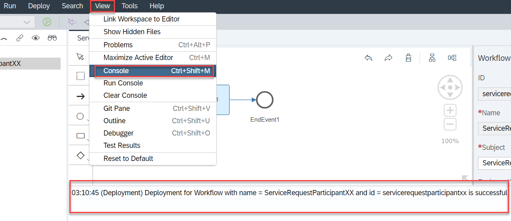

1. Congratulations! You have successfully created a workflow using SAP Web IDE Full-Stack.


### <a name="br"></a> SAP Cloud Platform Business Rules
SAP Cloud Platform Business Rules is a technology service that translates business decision logic into a natural language that is configurable directly by line of business key users, knowledge experts without IT or developer intervention. It provides solution architects and developers web based tools to model, author and simulate business rules independent of the backend system.

Please use for login the user given by your instructor.

#### --- Edit Threshold Exceeds Rule ---
SAP Cloud Platform Business Rules allows end users to model and arrange rules in the form of projects. To model a typical executable rule service the required vocabulary needs to be created in the form of data objects. The actual business logic is modelled in a set of rules and these are associated with the rule service using the rule set as logical containers.
To simplify the number of steps involved in modelling & deploying the rule service we already created a separate project for each participant with a decision table having all the necessary conditions and results.
Your goal here is to create a rule in the decision table to determine whether the measurement values are exceeding a threshold value. The final rule service is then deployed to make it available for the integration flow which is responsible to decide whether the Service Request workflow needs to be triggered.

1. Open the configuration URL document. Documents are available inside Iflowgenerator folder. Please use the file (URLS_rktw002.TXT or URLS_rktw003.TXT) assigned to you by the instructor, with the same steps you have done at the beginning of the previous chapter and locate the Business Rules Service Tenant URL. Copy this URL and paste it in a new browser window  
	

1.  Click on the project **CPL265ParticipantXX** where **XX** is your associated workstation ID  
	

1. Be sure you have selected the right project and select the **Rules** tab. Then click on the **ThresholdExceedsRule** item  
	

1. Once inside the project, click on **Edit**  
	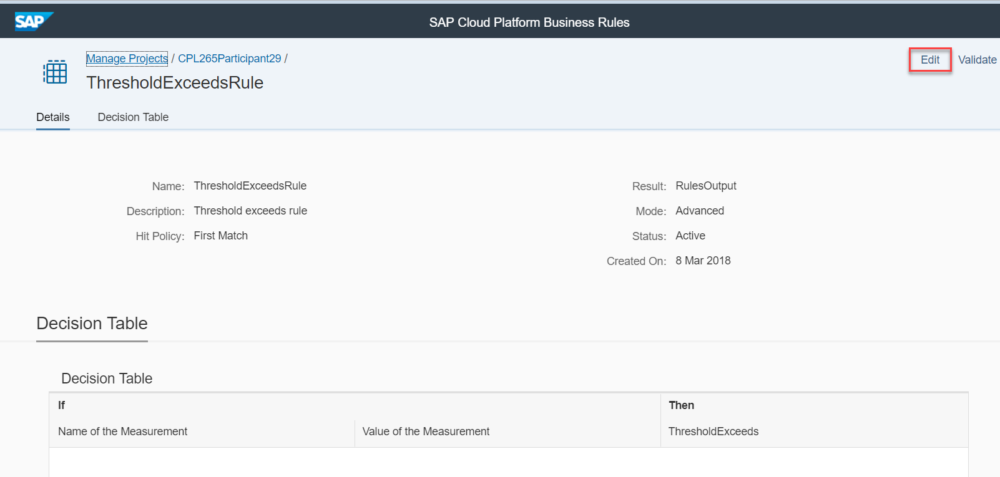

1. Click on **Add Row -> Insert First** in the **Decision Table** tab   
	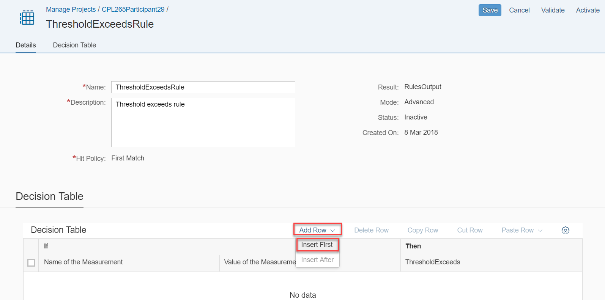

1. Specify the new rule with the following parameters:

	|Parameter|Value|
	|---------|-----|
	|Name of the Measurement|is equal to 'temperature'|
	|Value of the Measurement|is greater than 40|
	|ThesholdExceeds|true|

	then click on **Activate**
	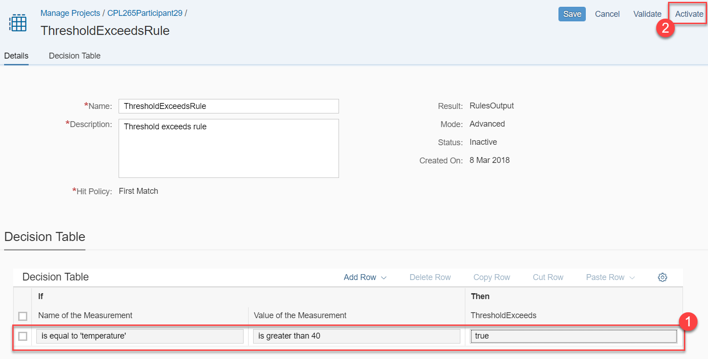

1. After a while you should receive a message that the rule has been successfully activated and the rule status changes to **Active**  
	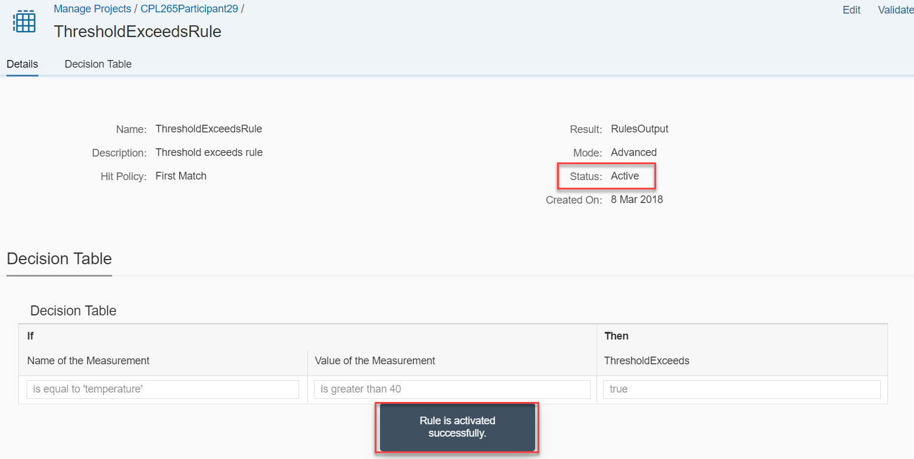


#### --- Deploy ThresholdExceeds Rule Service ---

1. Click on **CPL265ParticipantXX**, where **XX** represents your workstation ID, to go back to your rule project  
	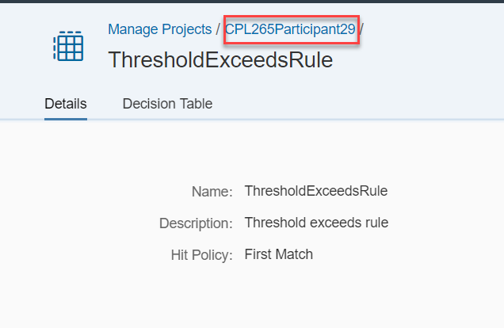

1. Select the **Rule Services** tab and click on **Deploy**  
	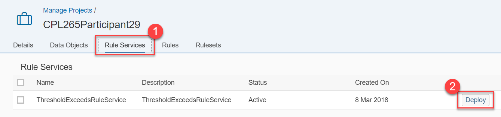

1. Select **CLOUD** as the system where to deploy  
	

1. The rule service is deployed successfully  
	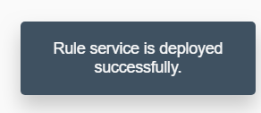

1. Congratulations! You have successfully created and deployed your new business rule.


### <a name="cp-integration"></a> Working with SAP Cloud Platform Integration
In this part, you will discover the CPL265 session Integration content from SAP Cloud Platform Integration Content hub, configure and deploy the integration content.


1.	Open Chrome browser and select the SAP Cloud Platform Integration tenant assigned to you. Logon to the SAP Cloud Integration tenant with the credentials provided by the session instructors. Please do NOT store your user's password when prompted. Select Never or Escape in this case  
	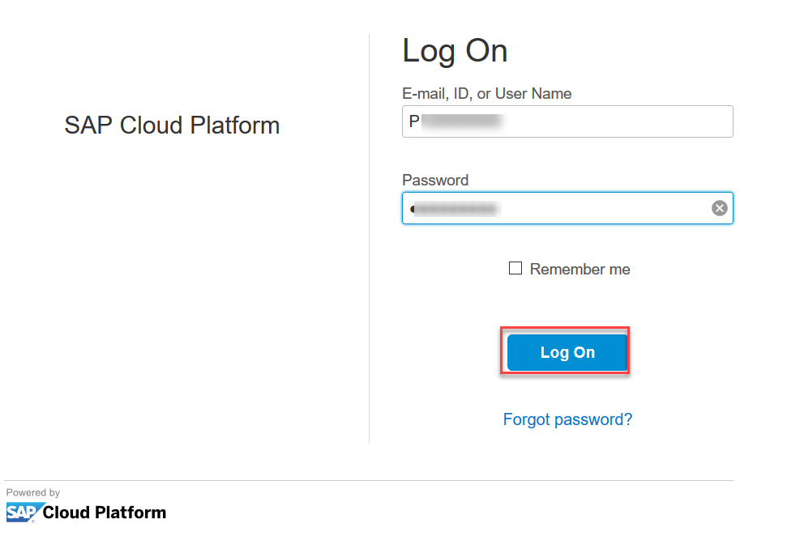

1.	On the Discover page of the SAP Cloud Platform Integration tenant, browse the **Design** space.  
  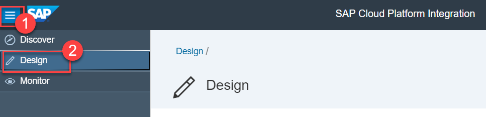

1.	Here, you will create an Integration Package to store your iFlows for the Exercise. Click on ***Create***.  
	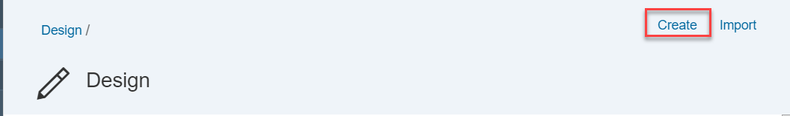

1. Enter details. **NOTE:** Replace XX with the workstation ID provided by the instructor. **Then Save**.  

  	|Field|Value|
  	|---------|-----|
  	|Name|IoT Maintenance Scenario-SAP Cloud Platform Integration Service Package XX|
  	|Short Description |CPL265 - Maintenance Scenario with SAP Cloud Platform Integration Service with calls to IoT Service and Workflow and Business Rules|
  	|Version |1.0.0|
  	|Vendor |SAP|
  	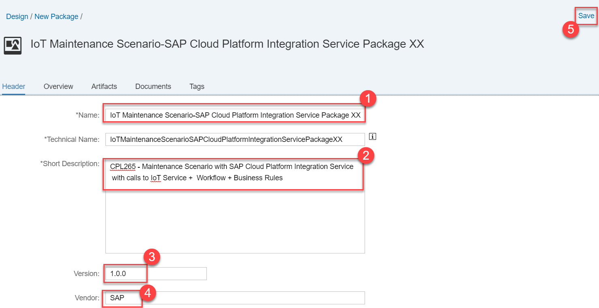

1. Select the **Artifacts** tab and click on **Add** for the drop down selection list. Select **Integration Flow**.
	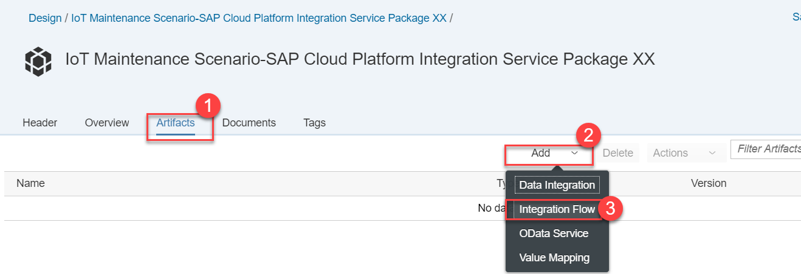

1.	Click on the **Upload** option, browse the **CPL265-IntegrationFlowXX.zip** file generated with the prerequisite step,
 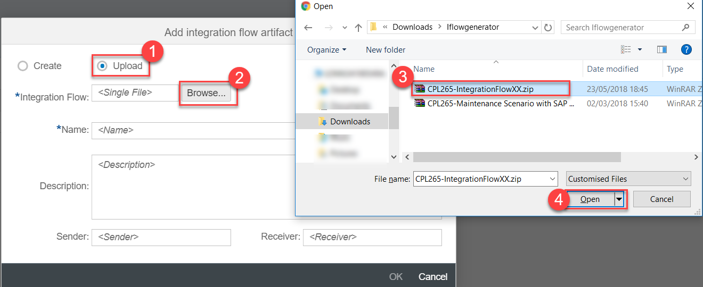

1. Enter the name "**CPL265-IntegrationFlowXX**" for the artifact (**XX** must be replaced by your workstation ID), enter a description like "**IoT Maintenance scenario**" and click on **OK**  
  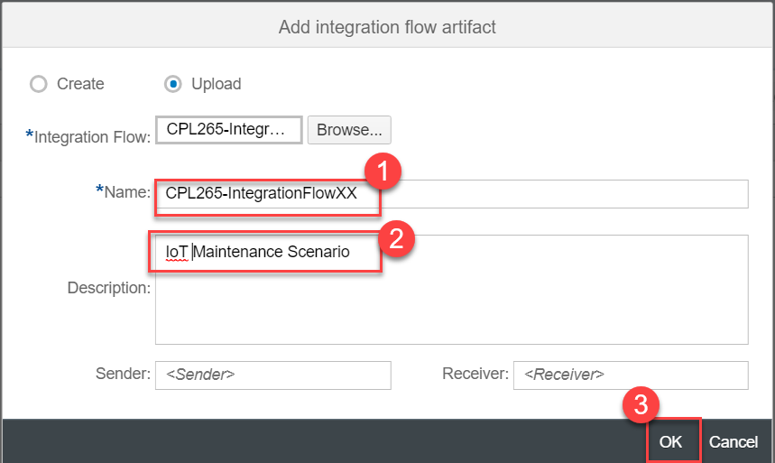

1. The artifact integration flow is uploaded. Click on **Save**  
  	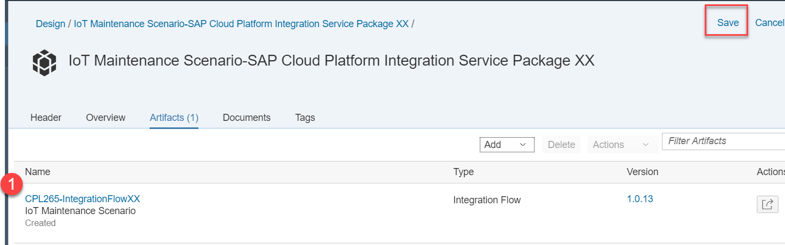

1. Ensure you are still on the **Artifacts** tab and click on your integration flow, the one named "**CPL265-IntegrationFlowXX**" where **XX** is your workstation ID

1. Make sure you are in your integration flow and click on the **Configure** button  
	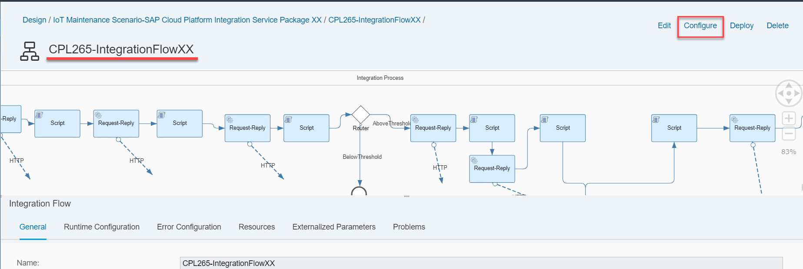

1. Choose **Workflow** in the Receiver dropdown and set the address to the link you can find in the Integration Service document under the **Receiver: WORKFLOW** section. Leave all other parameters as by default and click **Save**  
	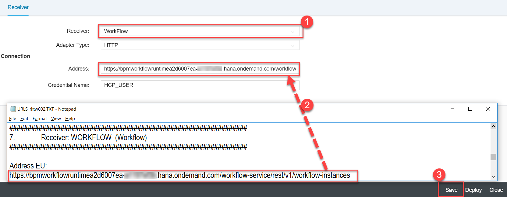

1. Choose **CSRF\_Provider\_WORKFLOW** in the Receiver dropdown and set the address to the link you can find in the Integration Service document under the **Receiver: CSRF\_Provider\_WORKFLOW** section. Leave all other parameters as by default and click **Save**  
	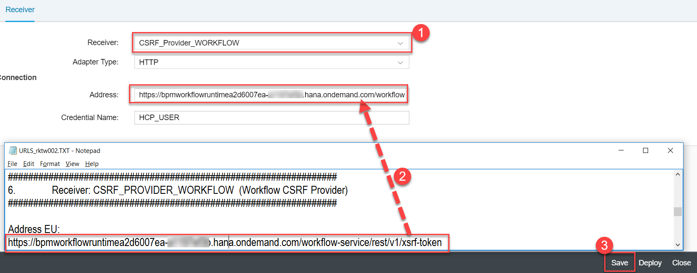

1. Choose **CSRF\_PROVIDER\_RULE\_ENGINE** in the Receiver box and set the address to the link you can find in the Integration Service document under the **Receiver: CSRF\_PROVIDER\_RULE\_ENGINE*** section. Leave all other parameters as by default and click **Save**  
	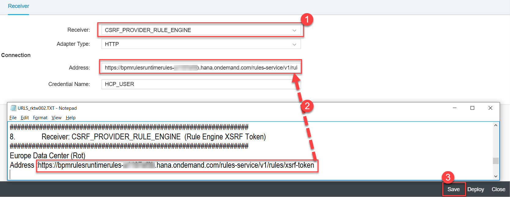

1. Now select **RuleEngine** in the Receiver drop down list. This needs to be set to the URL you can read in the Integration Service document under the **Receiver: RuleEngine** section. Even here, remember to use your **CPL265ParticipantXX** account, where **XX** is your workstation ID. Leave all other parameters as by default and click **Save**  
	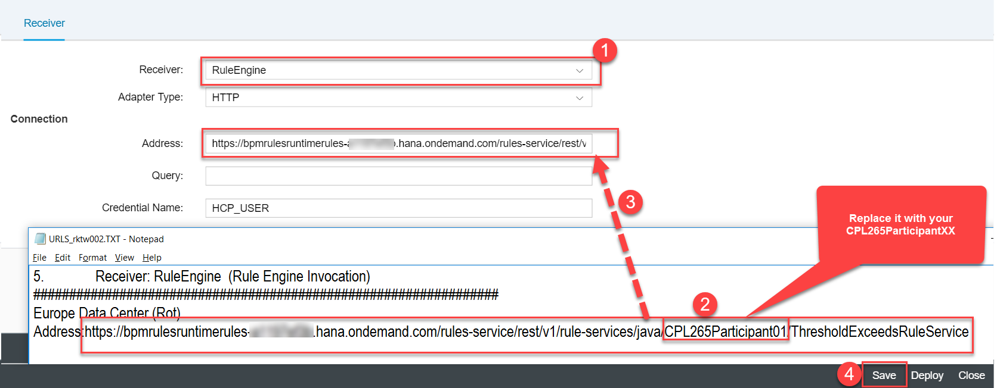

1. Select **IoTS4** in the Receiver drop down list and configure the **address** and the **query**, taking them from the Integration Service document. Remember to replace the **\<device\_ID\>** string with the ID of the device you created earlier. This ID can be read from the Device's details page in the IoT Service cockpit. Keep **HTTP** as Adapter Type and **IoTS4\_USER** as Credential Name.   
	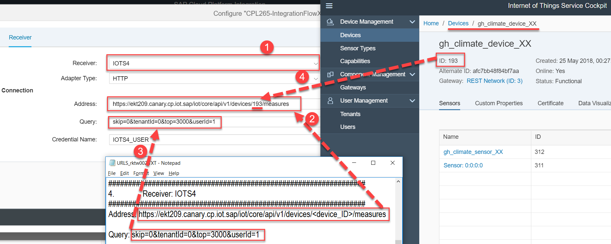

1. Once done click on **Save** and then Click on **Close**  
	
	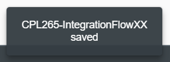

1. You are back now to your Integration Flow schema. Click on the **Edit** button on top of the screen  
	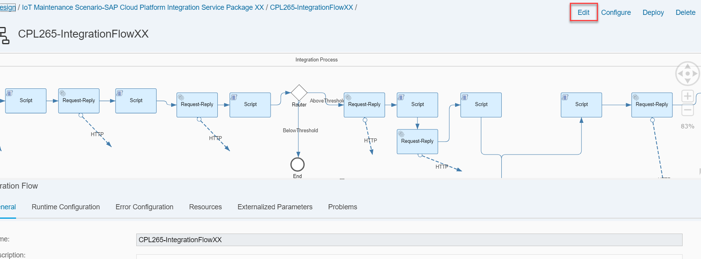

1. First select the **Workflow Configuration** box, then click on the **Exchange Property* tab. Set accordingly the following parameters:

	|Parameter |Value                                                   |
	|----------|--------------------------------------------------------|
	|devicename|gh_climate_device_XX (where XX is your workstation ID |
	|userid    |your P-Number user, you use to access SAP Cloud Platform|
	|deviceid  |the device ID of your device in IoT Cockpit|

	Once done click on **Save**  
	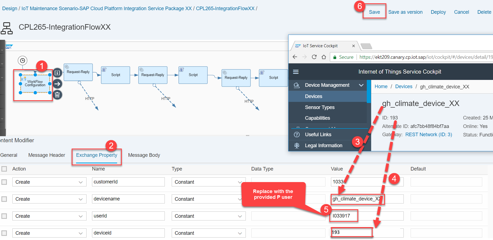

	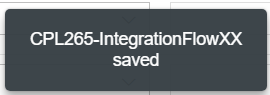

1.	Now click on **Deploy**  
	

1. Click **Yes**  
	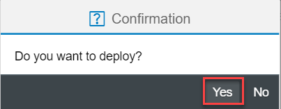

1. Click **OK**. You should get a success message
	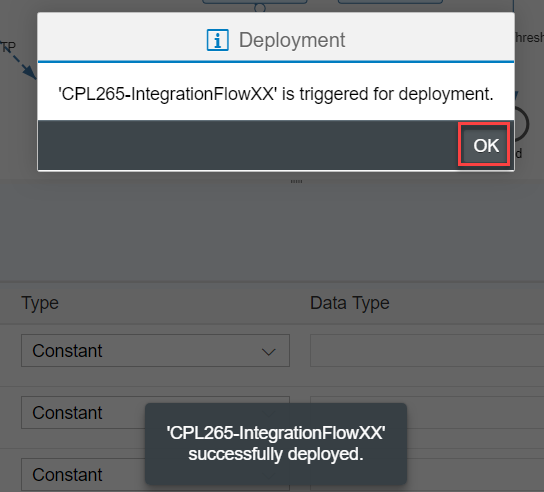

1. Go back to the SAP Cloud Platform Integration cockpit and click on Operations View (the "eye" icon on the left toolbar) button. Then in the **Manage Integration Content** section click on the **All** -> **All** tile (the first in this section)
	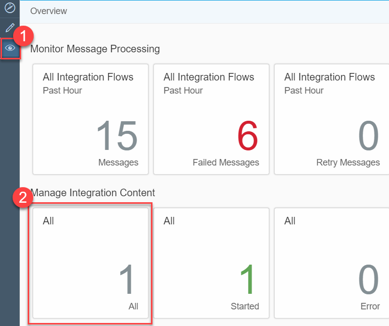

1. You should be able to see your CPL265 Integration Flow CPL265-IntegrationFlowXX (XX is your workstation ID) as **Started**. You can also search for it in the upper search box if you cannot find it. Click on your flow and select **Monitor Message Processing**  
	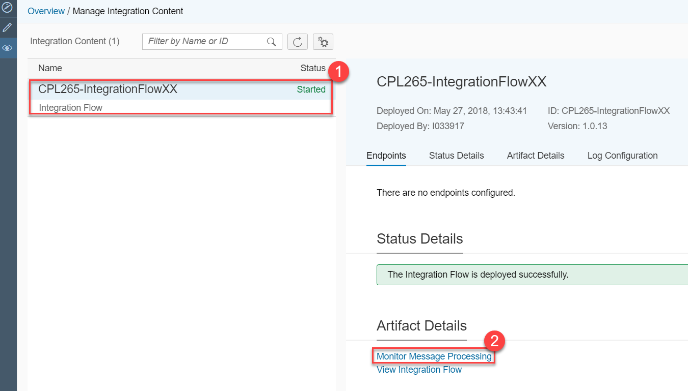

1. Your iFlow message processing should appear as completed. Click on the **Logs** tab
	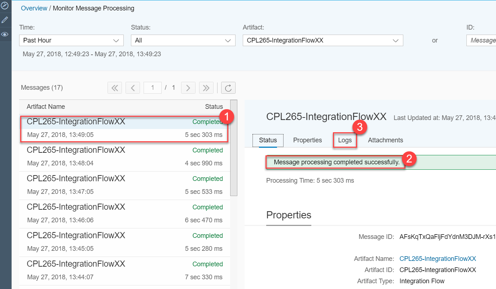

1. In the Logs tab, you should be able to see the various logs for the various service calls from the iFlow
	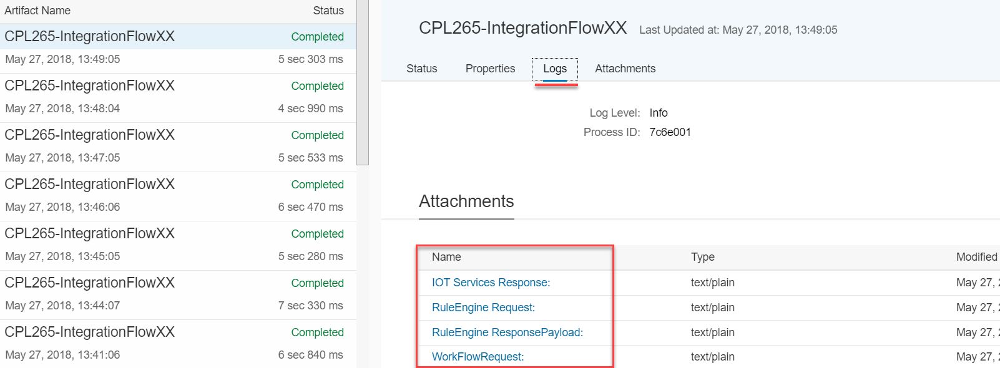

1. Congratulations! You have successfully configured and started your workflow in the SAP Cloud Integration service.


### <a name="scenario-completion"></a> Confirm successful scenario completion
In this section, we will confirm the successful scenario completion. This is done with the help of the "My Inbox" application from Cloud Platform Workflow, which shows service request confirmation tasks, and the "Monitor Workflows" application, which provides an overview on all workflow instances of an account's workflow subscription.

1. Open the SAP Fiori Launchpad which has been prepared for you by using the link displayed in the Integration Service document. Copy that link in the browser and navigate to it: at moment the launch pad should look completely empty. Click on the small **User Icon** on top left  
	

1. Click on the **App Finder** button  
	

1. Select **Workflow** from the left menu and start pinning the My Inbox application to the **My Home** group  
	

1. Do the same for the other 2 applications. At the end you should have all the 3 available applications pinned to the My Home page. Click on the **Home** button  
	

1. On the Home page you are able to see the 3 applications you pinned  
	

1. Open Postman  
	

1. Locate the old tab you used to send some data to the IoT Service and increase the temperature to 50; then click on **Send**  
	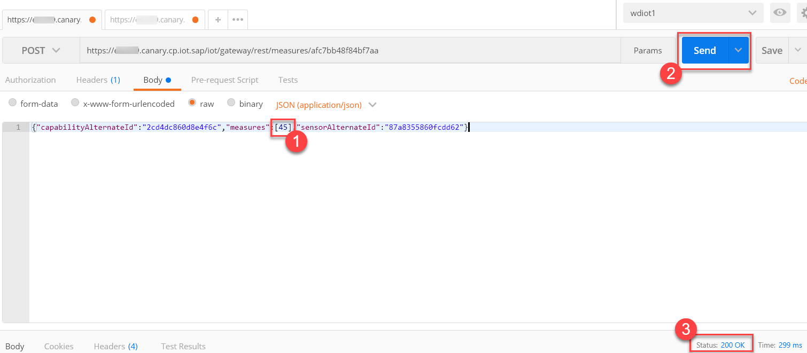

1. Go back to the Fiori Launchpad. Your My Inbox application should start receiving messages. Click on the tile to open the application  
	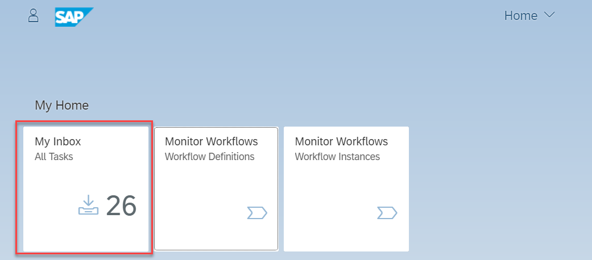

1. The application shows a list of messages in the inbox. Clicking on the last one for example, you can get some details regarding the content of the message  
	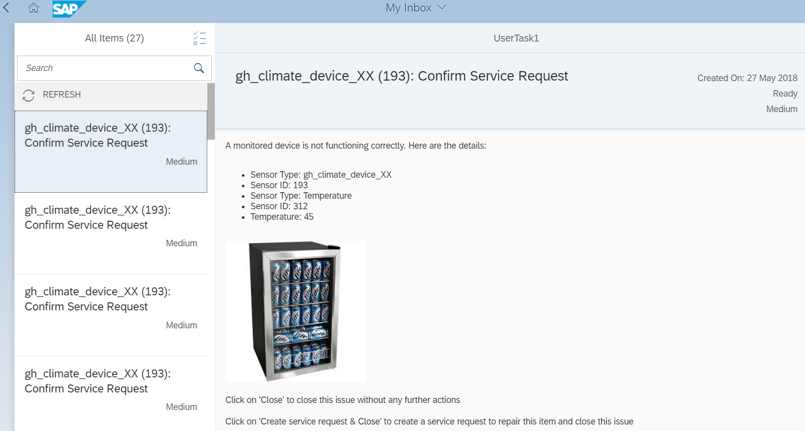

1. Exit from My Inbox and open the **Monitor Workflows** app  
	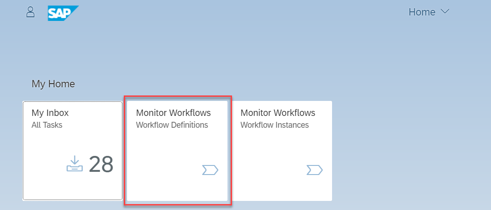

1. Locate on the left menu your **ServiceRequestParticipantXX** workflow, where **XX** is your workstation ID, and click on **Show Instances**  
	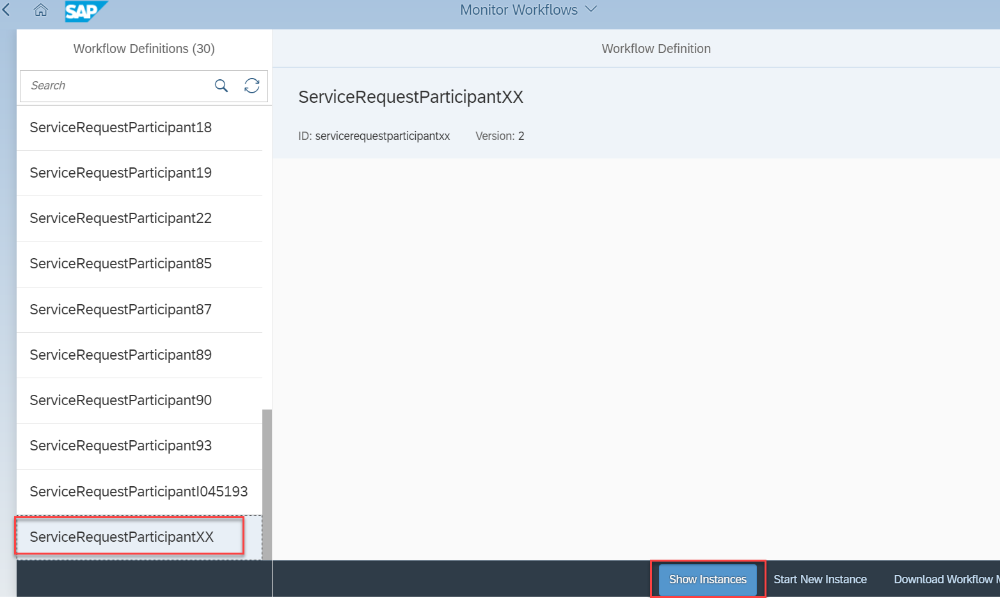

1. You can get some further details about the running instance  
	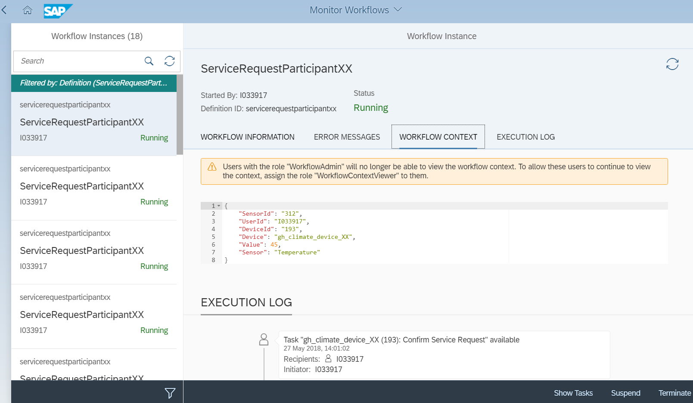

1. Alternatively you can get some information about the status of the ticket by cosnulting directly the **C4C** service. Open the Integration Service document and copy the URL of the C4C system involved in the workflow. Paste this URL in a new browser window  
	

1. Login with the credentials provided by your instructor  
	

1. Click on the **Service** tab  
	

1. You should be able to see a ticket related to your **gh_climate_device_XX** device, where **XX** is your workstation ID. Click on this ticket  
	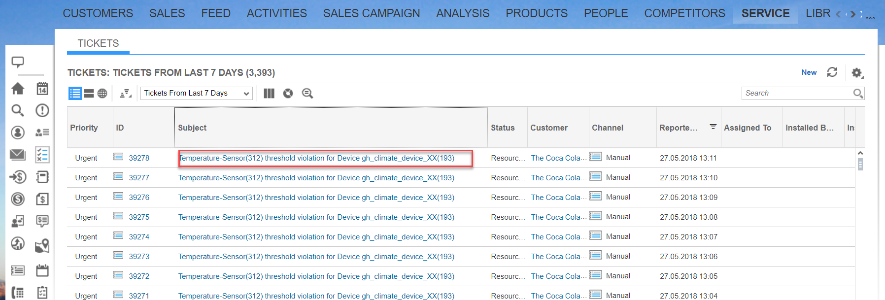

1. Here you get the content of the ticket where the Temperature Sensor violation is reported  
	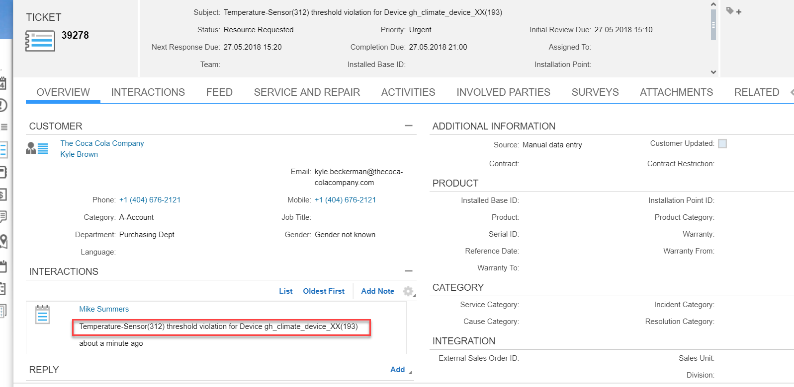

1. Congratulations! You have confirmed the whole scenario execution.


### <a name="house-keeping"></a> House Keeping
Once you are done with your hands on exercise kindly perform the following house keeping activity for SAP Cloud Platform Integration. Undeploy your configured integration flow to stop polling IoT data from SAP Cloud Platform Internet of Things.

1.	Go back to your SAP Cloud Platform Integration tenant. If needed logon with the credentials provided by your session instructor and click on **Log On**

1.	Go to the main menu at the left upper corner and choose **Monitor** and Choose the tile **Manage Integration Content / All**
	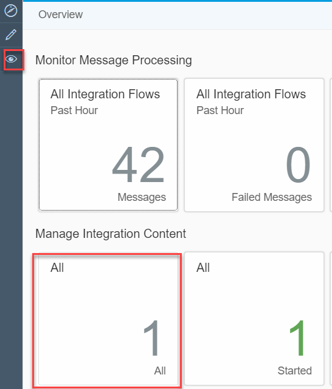

1.	For the search enter your **Workstation ID** to find your integration flow

1.	Select your **integration flow** from the list and Choose **Undeploy** in the detail view of your integration flow.
	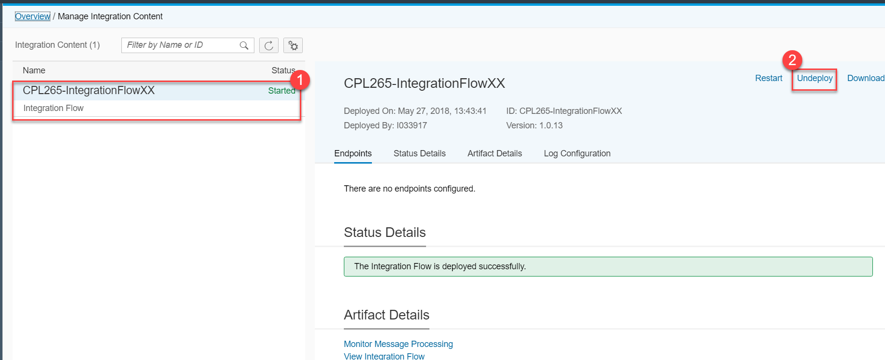

1.	Click on **Yes** to Undeploy the Artifact. The iFlow should now be undeployed to avoid polling every minute

	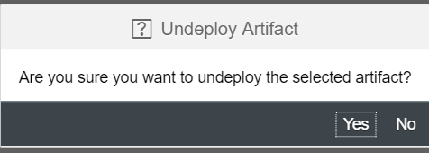


## Summary
You have completed the exercise!

You are now able to:

* onboard a device with IoT Gateway Cloud using REST protocol
* send data with a REST client
* work with SAP Cloud Platform Workflow service
* work with SAP Cloud Platform Business Rules service
* work with SAP Cloud Platform Integration, import and configure Integration Content
* deploy an Integration Flow
* monitor the workflow


Please proceed with next exercise.
